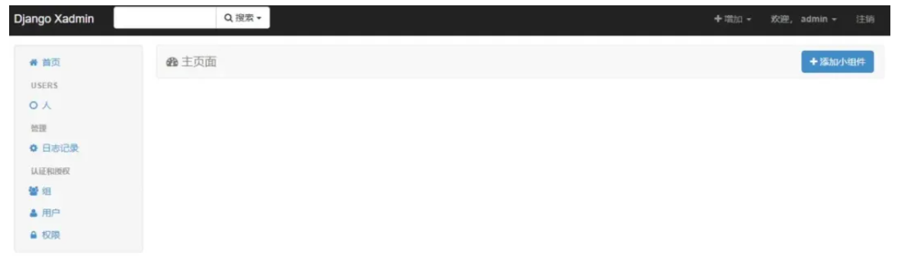
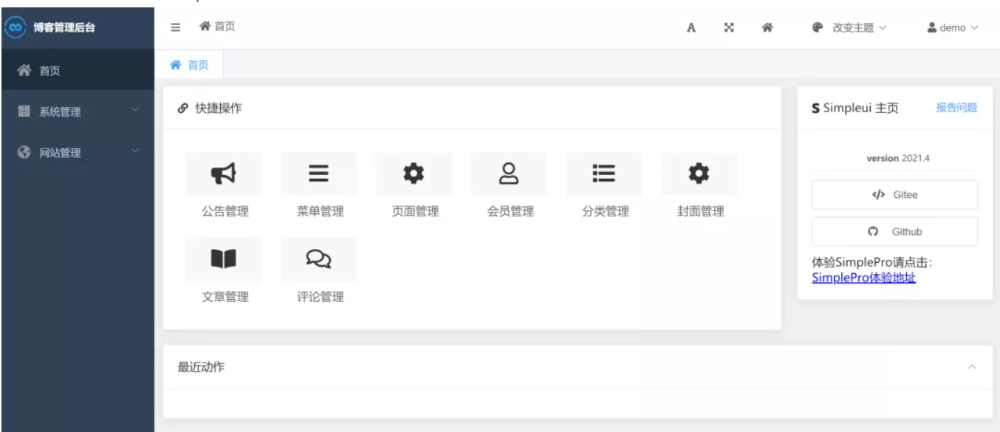
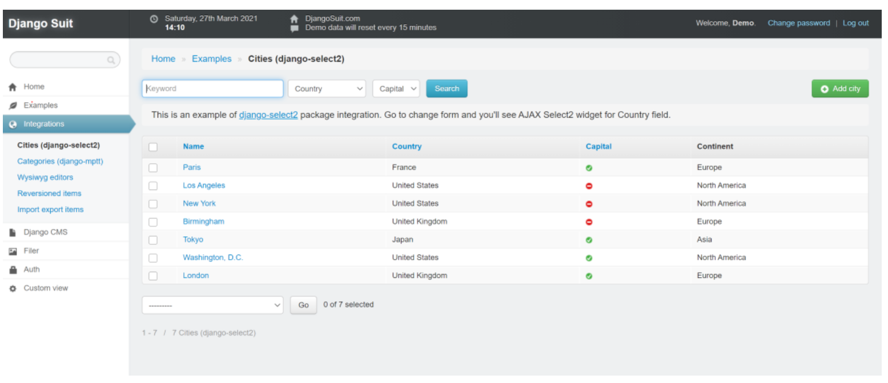
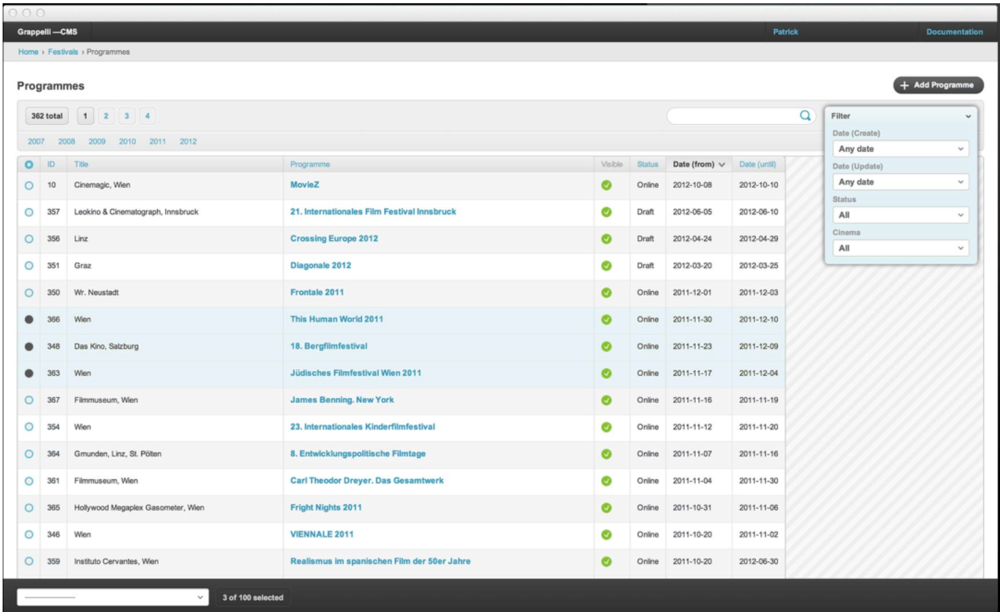
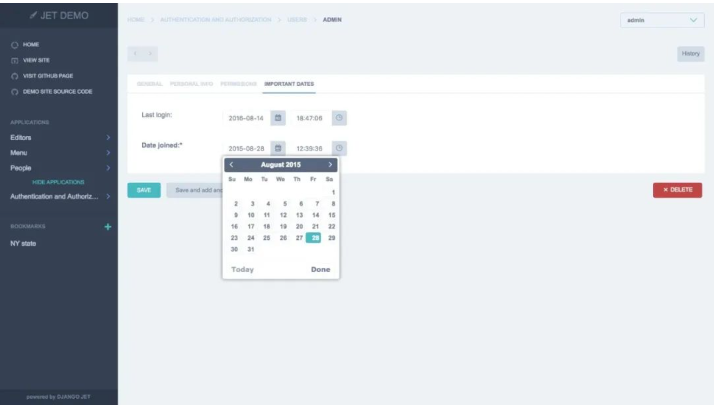
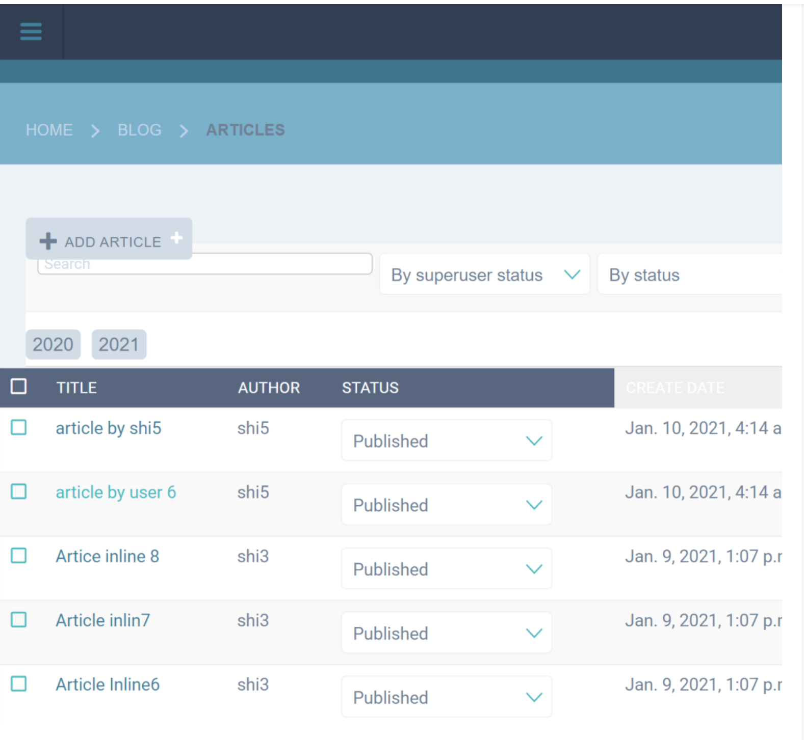
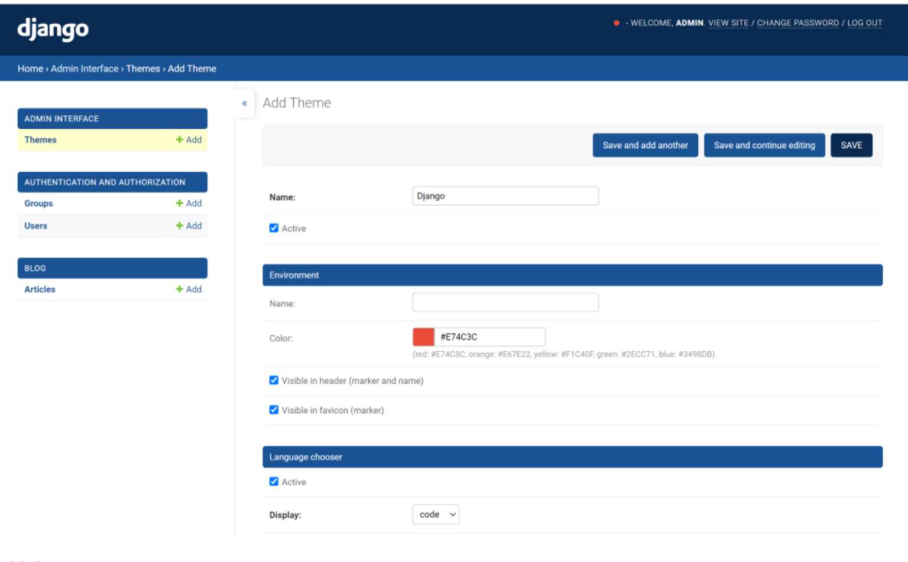

Django自带的admin管理后台简直就是bug级的存在，几行代码就可以撸出一个功能齐全的管理后台来，就像诸葛亮的媳妇黄月英,拥有和诸葛亮一样的才华, 只是不漂亮。对于内部人员使用的管理系统，业务功能远比外观重要，Django自带的admin就是遵循这个逻辑设计的。对于很多执着的程序员而言，怎么能让外观这事让自己写的NB代码大打折扣呢？幸好有很多第三方的库可以用来美化Django Admin管理后台的界面，今天小编我就来测评一下，也来当当皇帝选选妃。

## Django-xadmin

在Django 2.0时代，`django-xadmin`无疑是国内最火的用来美化Django admin的后台。它使用bootstrap 3的样式，几行设置即可替代django自带admin的界面，另外还提供了丰富的插件，比如导入导出数据。

不幸的是原作者并没有很好的维护这个项目。如果你希望在Django 3的项目开发中使用, 那么你需要下载django-xadmin修改些代码并进行二次开发，对新手有难度。另外它对Django 3.1后增加的侧边栏兼容不好，加之bootstrap 3的样式老套(bootstrap 5都快出了), 小编个人不推荐在Django 3以后的新项目中再使用这个库。黄脸婆 vs 绿茶妹，你选谁？

## Django-simpleui

`Django-simpleui`是django admin的一个主题 是一个基于element-ui+vue开发，界面符合国人审美标准，配置简单，可以改变多种主题。Django-simpleui稍显麻烦，比如左侧的logo和折叠菜单和右边的Simpleui主页链接。Django-simpleui分免费版和付费版本，大家可以酌情选择。

看完了国内的，咱们来看几个国外的，换换口味!

## Django-Suit

这个是国外开发的插件，与Django原生admin相比，主要就做了两个改变：1. 加了个侧边栏。2. 把原生admin最右边的filter变成了一行，移到了主体内容上面。

Django-suit非商业用途是免费的，但是用于商业用途的话一个项目license 45美金。其实这个收费真不贵，但你的容貌真对不起这个价格。Pass!

## Django-grappelli

Django-grappelli走的是极简清纯风，对第三方无插件依赖，无收费项目，而且人家是BSD license，你可以为所欲为的那种! 可惜名字太难记，要改成django-grape多好，你说是不是? 

## Django-jet

Django-jet采用了自适应的样式，配色不错，官方展示效果如下所示：

可小编实际使用后的效果如下所示。正式交往前真是不能光靠照片啊！

小编当前使用Django版本为3.1，可见这个库与Django 3.1的兼容性并不好，依然有很多issue存在。就这界面，黑一块，灰一块，还真不如使用原生的admin。

## Django-admin-interface

这个是比较新的插件，纯粹以css手段改变django admin的配色，与各个Django版本均兼容，包括Django 3.1以后的侧边栏。它还支持你直接在admin里自选配色，通过配色与前端的用户界面保持一致。缺点也很明显，除了配色，其它与django admin没有太多区别。

## 到底选哪个?

青菜萝卜各有所爱，也没有免费的午餐。小编个人更看重的是免费和兼容性，从这个角度看，小编首选**Django-grappelli**和**Django-admin-interface**。如果你不嫌配置麻烦Simple-UI也是一个不错的选择。你最喜欢哪个呢?

感谢大家过去的支持和关注。我是大江狗，一名Django技术开发爱好者。您可以通过搜索【<a href="https://blog.csdn.net/weixin_42134789">CSDN大江狗</a>】、【<a href="https://www.zhihu.com/people/shi-yun-bo-53">知乎大江狗</a>】和搜索微信公众号【Python Web与Django开发】关注我！
