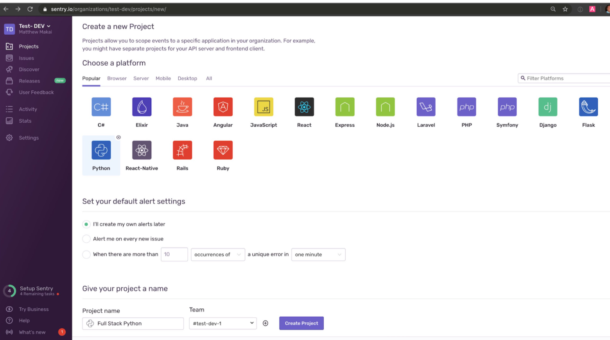

# Django日志管理
{: .no_toc }

## 目录
{: .no_toc .text-delta }

1. TOC
{:toc}

---
当Django项目正式部署上线后，我们便不可能像在开发时那样容易的及时发现处理错误和异常了。那么项目上线后开发者应怎样检查Django程序在生产环境运行时有什么异常或错误呢？答案就是日志(log)。本文将教你如何在Django项目中正确配置或管理日志。
{: .fs-6 .fw-300 }

## 日志基础
日志与我们的软件程序密不可分。它记录了程序的运行情况，可以给我们调试程序和故障排查提供非常有用的信息。每一条日志信息记录了一个事件的发生。具体而言，它包括了：

- 事件发生时间
- 事件发生位置
- 事件的严重程度--日志级别
- 事件内容

日志的级别又分为：

- `DEBUG`：用于调试目的的低级系统信息
- `INFO`：一般系统信息
- `WARNING`：描述已发生的小问题的警告信息。
- `ERROR`：描述已发生的主要问题的错误信息。
- `CRITICAL`：描述已发生的严重问题的信息。

在Django项目中，我们可以针对日志的不同级别设置不同的处理方式。比如INFO级别及以上的日志我们写入到log文件里保存，ERROR级别及以上的日志我们直接通过邮件发送给系统管理员。

## Django的日志模块

Django的日志模块其实就是python的`logging`模块。它由4部分组成：

- Logger 记录仪：生成和记录每条日志信息及级别
- Handler处理程序: 根据日志信息级别交由相应处理程序处理（比如生成文件或发送邮件）
- Filters 过滤器：日志交由处理程序处理前需要满足的过滤条件(比如Debug=True或False)
- Formaters 格式化程序：决定每条日志的打印输出格式，可以有完整版的，也有简单版的

一个`logger`记录仪的例子如下所示。当程序运行出现错误时，它生成了一条级别为error的日志信息。这条记录产生后就会交由`Handler`处理。

```python
import logging
# 获得logger实例
logger = logging.getLogger(__name__)
def my_view(request, arg1, arg2):
    ...
    if error_happens:
        # 如发生错误，记录错误信息
        logger.error('Something went wrong!')
```

当`Debug=True`时，日志信息默认在`console`输出。现在我们还需要在django配置文件里配置日志(logging)相关内容，使得当`Debug=False`时，日志信息会输出到日志文件里或发送给系统管理员。

## settings.py推荐日志配置

以下基本配置信息在django cookiecutter推荐使用的logging配置信息上做了修改，可适合大部分项目使用。如果真的希望发送和接收到邮件还需在`settings.py`正确配置电子邮箱Email。

```python
# 给ADMINS发送邮件需要配置
ADMINS = (
 ('admin_name','your@gmail.com'),
)
MANAGERS = ADMINS

# 创建log文件的文件夹
LOG_DIR = os.path.join(BASE_DIR, "logs")
if not os.path.exists(LOG_DIR): 
    os.mkdir(LOG_DIR) 

# 基本配置，可以复用的
LOGGING = {
    "version": 1,
    "disable_existing_loggers": False, # 禁用已经存在的logger实例
    "filters": {"require_debug_false": {"()": "django.utils.log.RequireDebugFalse"}},
    "formatters": { # 定义了两种日志格式
        "verbose": { # 详细
            "format": "%(levelname)s %(asctime)s %(module)s "
            "%(process)d %(thread)d %(message)s"
        },
        'simple': { # 简单
            'format': '[%(levelname)s][%(asctime)s][%(filename)s:%(lineno)d]%(message)s'
        },
    },
    "handlers": { # 定义了三种日志处理方式
        "mail_admins": { # 只有debug=False且Error级别以上发邮件给admin
            "level": "ERROR",
            "filters": ["require_debug_false"],
            "class": "django.utils.log.AdminEmailHandler",
        },
        'file': { # 对INFO级别以上信息以日志文件形式保存
            'level': "INFO", 
            'class': 'logging.handlers.RotatingFileHandler',  # 滚动生成日志，切割
            'filename': os.path.join(LOG_DIR,'django.log'),  # 日志文件名
            'maxBytes': 1024 * 1024 * 10,  # 单个日志文件最大为10M
            'backupCount': 5,  # 日志备份文件最大数量
            'formatter': 'simple', # 简单格式
            'encoding': 'utf-8', # 放置中文乱码
        },
        "console": { # 打印到终端console
            "level": "DEBUG",
            "class": "logging.StreamHandler",
            "formatter": "verbose",
        },
    },
    "root": {"level": "INFO", "handlers": ["console"]},
    "loggers": {
        "django.request": { # Django的request发生error会自动记录
            "handlers": ["mail_admins"],
            "level": "ERROR",
            "propagate": True,  # 向不向更高级别的logger传递
        },
        "django.security.DisallowedHost": { # 对于不在 ALLOWED_HOSTS 中的请求不发送报错邮件
            "level": "ERROR",
            "handlers": ["console", "mail_admins"],
            "propagate": True,
        },
    },
}
```

以上配置中大家最需要了解的就是Python提供的`RotatingFileHandler`, 其作用是滚动生成日志文件，当单个日志的文件大小达到上限时，会生成新的日志文件。当总的日志文件数量超过日志备份最大数量时删除老的日志文件。

## 其它日志管理工具

在前面日志配置中，我们使用了Python自带的`logging`模块, 另外两个常用的日志管理工具是`loguru`和`sentry`。我们将简单演示如何使用。

###  loguru

```bash
pip install loguru
```

安装好后在Django项目中可以直接在视图中使用，省去复杂的配置，非常便捷。它定义了日志文件名、每条记录的格式、日志文件的轮替以及过滤级别。

```python
from loguru import logger
 
logger.add("django.log", format="{time:YYYY-MM-DD at HH:mm:ss} | {level} | {message}", rotation="100 MB", filter="", level="INFO", encoding='utf-8')
def my_view(request, arg1, arg2):
    ...
    if error_happens:
        logger.error("Something went wrong")
```

### sentry

Sentry为多种语言以及各种框架(包括Django)提供了SDK。只需几行配置，sentry就会监控你的程序运行，自动收集错误和异常以及上下文数据，发送到sentry的服务器上，开发者可以通过sentry的web端实时查看错误和异常。

第一步：安装sentry-sdk

```python
pip install --upgrade sentry-sdk
```

第二步：注册登录sentry，创建Django项目，获取一个公共密钥PublicKey地址，第三步会用到。



第三步：修改`settings.py`，如下所示：

```python
import sentry_sdk
from sentry_sdk.integrations.django import DjangoIntegration

sentry_sdk.init(
    dsn="https://examplePublicKey@o0.ingest.sentry.io/0", # 你的PublicKey
    integrations=[DjangoIntegration()],

    # Set traces_sample_rate to 1.0 to capture 100%
    # of transactions for performance monitoring.
    # We recommend adjusting this value in production,
    traces_sample_rate=1.0,

    # If you wish to associate users to errors (assuming you are using
    # django.contrib.auth) you may enable sending PII data.
    send_default_pii=True,

    # By default the SDK will try to use the SENTRY_RELEASE
    # environment variable, or infer a git commit
    # SHA as release, however you may want to set
    # something more human-readable.
    # release="myapp@1.0.0",
)
```

配置就这么简单，你以后都可以通过sentry的web端直接查看Django项目运行的错误和异常了。

## 小结

日志对于捕捉生产环境里程序的错误和异常非常重要。本文介绍了日志的基础知识以及如何在Django项目中配置日志，比如logging, loguru和sentry。你最喜欢哪个呢?

原创不易，转载请注明来源。我是大江狗，一名Django技术开发爱好者。您可以通过搜索【<a href="https://blog.csdn.net/weixin_42134789">CSDN大江狗</a>】、【<a href="https://www.zhihu.com/people/shi-yun-bo-53">知乎大江狗</a>】和搜索微信公众号【Python Web与Django开发】关注我！

