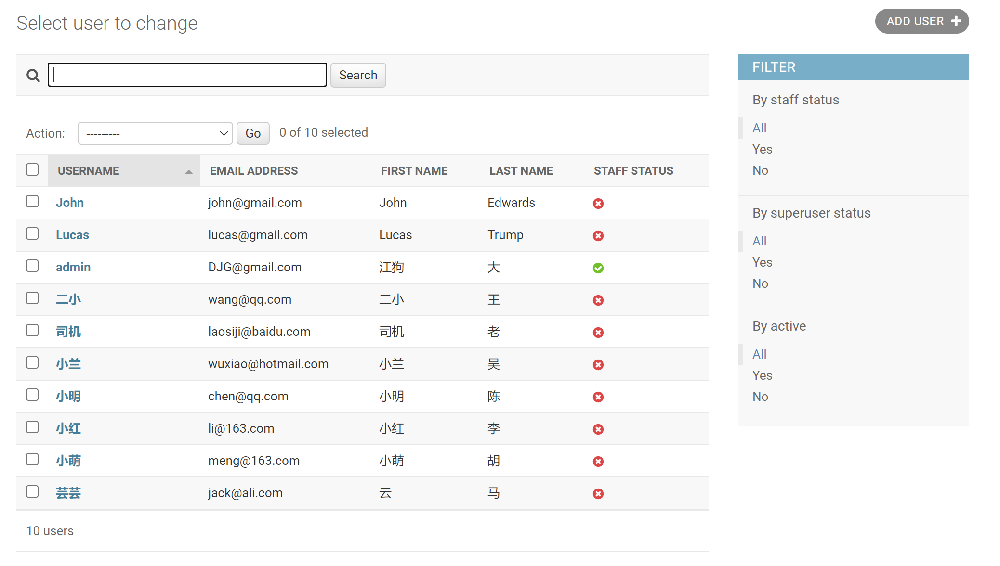
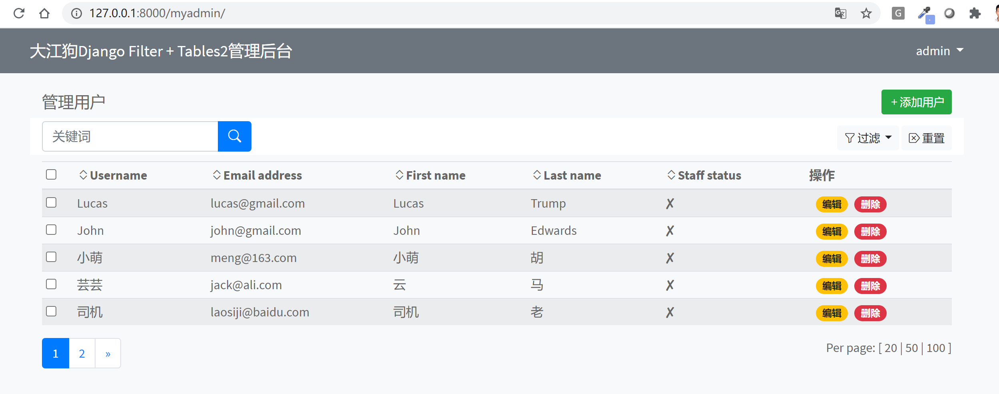
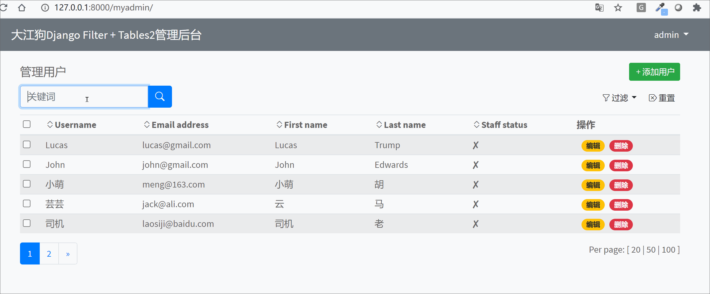
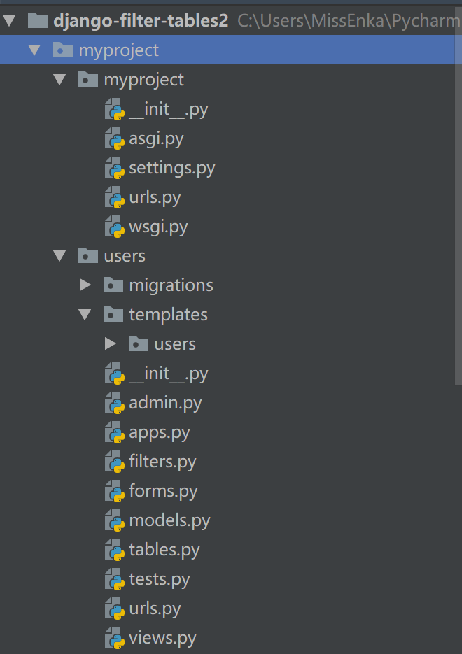
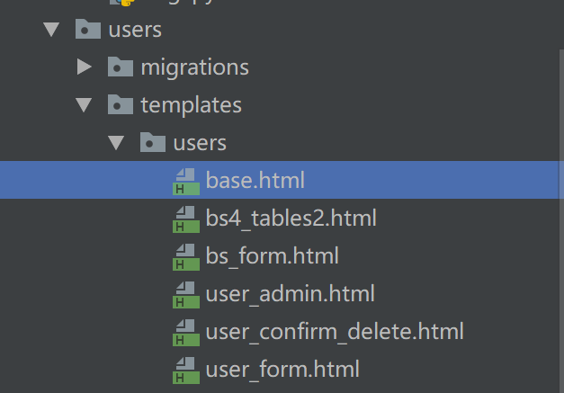

# Django实战：使用django-filter和django-tables2打造美观的管理后台
{: .no_toc }

## 目录
{: .no_toc .text-delta }

1. TOC
{:toc}

---
Django自带管理后台(admin)功能强大，允许我们对模型数据进行过滤筛选和增删改查，但是不够美观,  一般仅限内部人员使用。本例将演示如何使用`django-filter`和`django-tables2`打造功能性强且美观的管理后台，前端使用Boostrap 4。
{: .fs-6 .fw-300 }

##  项目演示效果
下图为Django自带admin对用户管理的界面。

下图是本例使用`django-filter`和`django-tables2`打造的用户管理界面，是不是美观多了? 这个后台支持过滤、重置、按各种字段排序、分页等常见功能。


如果你还不过瘾，可以看下动画效果。



废话不多说，我们开始干吧。关注微信公众号【Python Web与Django开发】，发送消息【Django后台实战】，可以获取GitHub源码地址。

## 第一步 安装项目依赖

本项目所需的第三方安装包如下所示，均使用了最新版本，保证未来2-3年都不会过时，使用`pip`安装即可。

```python
Django==3.2.2
django-filter==2.4.0 # 自定义过滤字段
django-tables2==2.3.4  # 自定义表格显示字段
django-widget-tweaks==1.4.8 # 用户美化表单
```

建议先创建虚拟环境再pip安装，如果你不会创建和激活虚拟环境，请先阅读https://pythondjango.cn/django/basics/2-installation-use/。

##  第二步 创建项目和应用
先使用`django-admin startproject myproject`创建一个名为`myproject`的应用，接着使用`python manage.py startapp users `创建一个名为`users`的app，并把它和其它三个项目依赖加入到`settings.py`的INSTALLED_APPS中去。

```python
INSTALLED_APPS = [
    'django.contrib.admin',
    'django.contrib.auth',
    'django.contrib.contenttypes',
    'django.contrib.sessions',
    'django.contrib.messages',
    'django.contrib.staticfiles',
    'widget_tweaks', # 项目依赖
    'django_tables2',# 项目依赖
    'django_filters',# 项目依赖
    'users', # 自建应用
]
```


然后把app下的urls路径加入到项目文件夹的urls.py里去。

 ```python
from django.contrib import admin
from django.urls import path, include

urlpatterns = [
    path('admin/', admin.site.urls),
    path('myadmin/', include('users.urls'))
]
 ```

整个项目的布局如下所示：



本例使用Django自带的User模型，无需创建模型，但考虑到后续存在切换自定义用户模型的可能性，我们使用`get_user_model`方法获取用户模型。

修改`models.py`, 添加如下代码：

```python
# users/models.py
from django.contrib.auth import get_user_model

User = get_user_model()
```

## 第三步 编写URLs和视图

在`users` 目录下新建`urls.py`, 添加如下代码：

```python
# users/urls.py
from django.urls import path, re_path
from . import views

app_name = "users"

urlpatterns = [
    path('', views.UserAdminTableView.as_view(), name='user_admin'),
    path('users/create/', views.UserCreateView.as_view(), name='user_create'),
    path('users/<int:pk>/update/', views.UserUpdateView.as_view(), name='user_update'),
    path('users/<int:pk>/delete/', views.UserDeleteView.as_view(), name='user_delete'),
]

```

接下来编写与各个url路由对应的视图，它们位于`user`目录下`views.py`, 代码如下所示：

```python
# users/urls.py
# 核心Django模块，比如Mixins和通用视图
from django.contrib.auth.mixins import LoginRequiredMixin
from django.views.generic import CreateView, UpdateView, DeleteView
from django.urls import reverse_lazy
from .models import User

# django fitler和django_tables2提供的Mixins
from django_tables2 import SingleTableView, RequestConfig
from django_filters.views import FilterView

# filters.py定义了用哪些字段对模型进行过滤
from .filters import UserFilter

# tables.py定义了用哪些字段将在表格中展示
from .tables import UserTable

# forms.py定义了用哪些字段创建或更新用户
from .forms import UserForm

# 管理用户主界面
class UserAdminTableView(LoginRequiredMixin, SingleTableView, FilterView):
    filter = None
    # 使用UserFilter过滤
    filter_class = UserFilter
    # 使用UserTable展示数据
    table_class = UserTable
    template_name = 'users/user_admin.html'

    # 获取过滤后的查询集
    def get_queryset(self, **kwargs):
        qs = User.objects.all().order_by('-id')
        self.filter = self.filter_class(self.request.GET, queryset=qs)
        return self.filter.qs

    # 将查询集与table实例集合，提供filter和table两个变量前端渲染
    # 每页5条记录
    def get_context_data(self, **kwargs):
        context = super().get_context_data(**kwargs)
        t = self.table_class(data=self.get_queryset())
        RequestConfig(self.request, paginate={"per_page": 5}).configure(t)
        context['filter'] = self.filter
        context['table'] = t
        return context

# create
class UserCreateView(LoginRequiredMixin, CreateView):
    model = User
    template_name = 'users/user_form.html'
    form_class = UserForm
    success_url = reverse_lazy('users:user_admin')

# update
class UserUpdateView(LoginRequiredMixin, UpdateView):
    model = User
    template_name = 'users/user_form.html'
    form_class =  UserForm
    success_url = reverse_lazy('users:user_admin')

# Delete
class UserDeleteView(LoginRequiredMixin, DeleteView):
    model = User
    template_name = 'users/user_confirm_delete.html'
    success_url = reverse_lazy('users:user_admin')

```

在视图中我们分别使用了`UserFilter`, `UserTable`和 `UserForm`， 它们分别位于users目录下的`filters.py`, `tables.py`和 `forms.py`，代码如下所示：

```python
# users/filters.py
import django_filters
from django.db.models import Q
from .models import User

class UserFilter(django_filters.FilterSet):
    '''
    Filter user by username, email, is_staff, ect
    '''
    # 自定义过滤字段
    query = django_filters.CharFilter(method='my_custom_filter', label='关键词')

    def my_custom_filter(self, queryset, q, value):
        return queryset.filter(Q(username__icontains=value) | Q(email__icontains=value))

    class Meta:
        # 使用哪个模型和哪些字段过滤
        model = User
        fields = {
            'is_staff',
            'is_superuser',
            'is_active'
        }

# users/tables.py
import django_tables2 as tables
from django.utils.html import format_html
from django.urls import reverse
from .models import User

class UserTable(tables.Table):
    id_select = tables.CheckBoxColumn(accessor="id", orderable=False, exclude_from_export=True)
    actions = tables.Column(empty_values=(), verbose_name="操作", orderable=False, exclude_from_export=True)

    class Meta:
        # 使用哪个模型
        model = User
        # 表格中显示哪些字段
        fields = ['username', 'email', 'first_name', 'last_name', 'is_staff']
        # 表格中字段显示顺序
        sequence = ['id_select'] + fields + ['actions']
        # 表格模板
        template_name = "users/bs4_tables2.html"
        # 表格样式
        attrs = {"class": "table table-striped table-sm text-nowrap"}
        # 排序字段
        order_by_field = 'sort_by' # default: sort
        # page_field = 'page'

    # 自定义操作链接
    def render_actions(self, value, record):
        return format_html(
        '<a class="btn btn-sm badge badge-pill badge-warning ml-2" href= "' +
        reverse("users:user_update", args=[str(record.pk)]) + '">' + '编辑' + '</a>'
        + '<a class=" btn  btn-sm badge badge-pill badge-danger ml-2" href= "' +
        reverse("users:user_delete", args=[str(record.pk)]) + '">' + '删除' + '</a>'
        )

# users/forms.py
from django import forms
from .models import User

class UserForm(forms.ModelForm):
    class Meta:
        # 自定义使用哪个模型和哪些字段来创建和更新用户
        model = User
        fields = ('username', 'email', 'password', 'first_name', 'last_name')

        widgets = {
            'password':forms.PasswordInput(),
        }
```

## 第四步 编写模板

本项目一共使用到6个模板文件，它们位于`users\templates\users`目录下：



这里着重看下`user_admin.html`的代码，它继承了BS4风格的`base.html`, 使用了`bs_form.html`来显示表单和`render_table`命令渲染BS4风格的表格。

```html





     <div class="align-items-center row">
             <div class="col-6 pt-2">
                    <h5>管理用户</h5>
             </div>
             <div class="col-6">
                     <span class="dropdown float-right">
                        <a href=""><button type="button" id="modal-create-btn" class="btn btn-sm btn-success"
                                 data-toggle="tooltip" data-placement="top" title="添加用户">
                         <i class="bi bi-plus"></i>添加用户</button></a>
                    </span>
              </div>
     </div>

    <div class="align-items-center py-1 row bg-white">
             <div class="col-sm-6 col-md-3">
                 <form class="" action="" method="get">
                     <div class="input-group">
                         <input type="text" name="query" class="form-control search-menu"
                            autocomplete="off" placeholder="关键词" value="{{ request.GET.query }}">
                         <div class="input-group-append">
                                <button class="btn btn-primary" type="submit">
                                    <i class="bi bi-search" aria-hidden="true"></i>
                                </button>
                         </div>
                     </div>
                 </form>
             </div>

              <div class="col-sm-6 col-md-9 mt-1">
                  <span class="dropdown float-md-right">
                        <button type="button" class="btn btn-sm btn-light dropdown-toggle my-0" data-toggle="dropdown" aria-expanded="false">
                         <i class="bi bi-funnel"></i> 过滤
                     </button>
                     <div class="dropdown-menu dropdown-menu-right px-3 mt-2" role="menu" style="width:280px">
                         <form class="form-horizontal" role="form" autocomplete="off">
                             
                             <button type="submit" class="btn btn-sm btn-info form-control">确定</button>
                         </form>
                     </div>

                      <a href="{{ request.path }}" class="btn btn-light btn-sm">
                      <i class="bi bi-backspace-reverse"></i> 重置
                      </a>

                    </span>
             </div>
         </div>
        

```

本例中的`base.html`，`bs_form.html`和`bs4_tables2.html`都是高度可重用的Bootstrap 4模板，可以无需修改适用于任何项目和app。关注微信公众号【Python Web与Django开发】，发送消息【Django后台实战】，可以获取GitHub源码地址，下载完整项目和精美的模板。

整个项目一共只有25个文件，非常值得一看和学习练手哦。

```python
create mode 100644 myproject/db.sqlite3
create mode 100644 myproject/manage.py
create mode 100644 myproject/myproject/__init__.py
create mode 100644 myproject/myproject/asgi.py
create mode 100644 myproject/myproject/settings.py
create mode 100644 myproject/myproject/urls.py
create mode 100644 myproject/myproject/wsgi.py
create mode 100644 myproject/requirements.txt
create mode 100644 myproject/users/__init__.py
create mode 100644 myproject/users/admin.py
create mode 100644 myproject/users/apps.py
create mode 100644 myproject/users/filters.py
create mode 100644 myproject/users/forms.py
create mode 100644 myproject/users/migrations/__init__.py
create mode 100644 myproject/users/models.py
create mode 100644 myproject/users/tables.py
create mode 100644 myproject/users/templates/users/base.html
create mode 100644 myproject/users/templates/users/bs4_tables2.html
create mode 100644 myproject/users/templates/users/bs_form.html
create mode 100644 myproject/users/templates/users/user_admin.html
create mode 100644 myproject/users/templates/users/user_confirm_delete.html
create mode 100644 myproject/users/templates/users/user_form.html
create mode 100644 myproject/users/tests.py
create mode 100644 myproject/users/urls.py
create mode 100644 myproject/users/views.py
```

## 第五步 查看效果

连续运行如下命令，先登录/admin/添加一些用户，在访问127.0.0.0.1:8000/myadmin就可以查看文初的效果啦。

```python 
python manage.py makemigrations
python manage.py migrate
python manage.py createsuperuser
python manage.py runserver
```

原创不易，转载请注明来源。我是大江狗，一名Django技术开发爱好者。您可以通过搜索【<a href="https://blog.csdn.net/weixin_42134789">CSDN大江狗</a>】、【<a href="https://www.zhihu.com/people/shi-yun-bo-53">知乎大江狗</a>】和搜索微信公众号【Python Web与Django开发】关注我！


