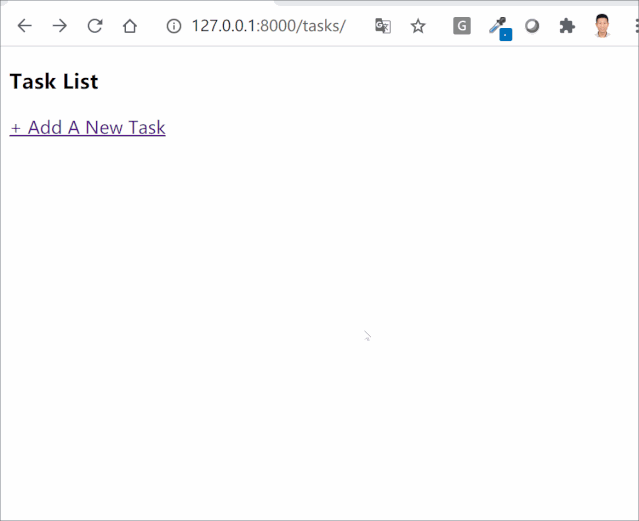
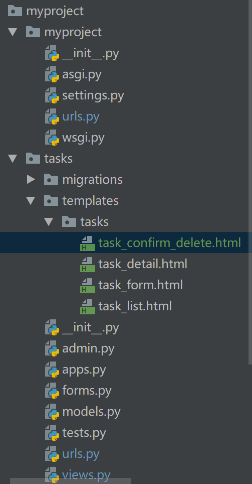

# Django实战：使用通用类视图开发任务管理CRUD小应用
{: .no_toc }

## 目录
{: .no_toc .text-delta }

1. TOC
{:toc}

---
在基础文章中，我们利用了Django基于函数的视图编写一个任务管理小应用，实现创建(Create)一个任务，查看(Retrieve)任务清单和单个任务详情，更新(Update)一个任务和删除(Delete)一个任务。本例中我们将使用Django基于类的视图(CBV)重写之前的小应用程序, 一共只有16行核心代码。
{: .fs-6 .fw-300 }

本例只讲述核心逻辑，不浪费时间在前端样式上。本次案例演示效果如下所示：



## 第一步：创建tasks应用，把它加入INSTALLED_APPS
首先使用 `python manage.py startapp tasks` 创建一个名为`tasks`的app，并把它计入到`settings.py`的INSTALLED_APPS中去。

```python
INSTALLED_APPS = [
    'django.contrib.admin',
    'django.contrib.auth',
    'django.contrib.contenttypes',
    'django.contrib.sessions',
    'django.contrib.messages',
    'django.contrib.staticfiles',
    'tasks',
]
```


然后把app下的urls路径加入到项目文件夹的urls.py里去。

```python
from django.contrib import admin
from django.urls import path, include

urlpatterns = [
    path('admin/', admin.site.urls),
    path('tasks/', include('tasks.urls'))
]
```

## 第二步：创建Task模型及其关联表单
我们的Task模型非常简单，仅包含`name`和`status`两个字段. 我们还使用ModelForm类创建了`TaskForm`，我们在创建任务或更新任务时需要用到这个表单。

```python
# tasks/models.py
from django.db import models

class Status(models.TextChoices):
    UNSTARTED = 'u', "Not started yet"
    ONGOING = 'o', "Ongoing"
    FINISHED = 'f', "Finished"


class Task(models.Model):
    name = models.CharField(verbose_name="Task name", max_length=65, unique=True)
    status = models.CharField(verbose_name="Task status", max_length=1,
                              choices=Status.choices)
    def __str__(self):
        return self.name

    
 # tasks/forms.py
from .models import Task
from django import forms


class TaskForm(forms.ModelForm):
    class Meta:
        model = Task
        fields = "__all__"
```

## 第三步：编写路由URLConfs及其相关视图函数
我们需要创建5个urls, 对应5个基于类的视图。这是因为对于`Retrieve`操作，我们需要编写两个类视图，一个用于获取任务列表，一个用于获取任务详情。对于`task_detail`, `task_update`和`task_delete`这个三个类视图，我们还需要通过urls传递任务id或pk参数，否则它们不知道对哪个对象进行操作。

注意：在编写路由`urls.py`时，基于类的视图需要使用`as_view()`方法将其装饰成函数。

```python
# tasks/urls.py
 from django.urls import path, re_path
 from . import views

 # namespace
 app_name = 'tasks'

 urlpatterns = [
    # Create a task
    path('create/', views.TaskCreateView.as_view(), name='task_create'),
    # Retrieve task list
    path('', views.TaskListView.as_view(), name='task_list'),
    # Retrieve single task object
    re_path(r'^(?P<pk>\d+)/$', views.TaskDetailView.as_view(), name='task_detail'),
    # Update a task
    re_path(r'^(?P<pk>\d+)/update/$', views.TaskUpdateView.as_view(), name='task_update'),
    # Delete a task
    re_path(r'^(?P<pk>\d+)/delete/$', views.TaskDeleteView.as_view(), name='task_delete')
 ]
```

下面5个基于类的视图是本应用的核心代码，它们分别继承了Django通用类视图的`ListView`, `DetailView`, `CreateView`, `UpdateView`和`DeleteView`。

```python
# tasks/views.py
from django.urls import reverse, reverse_lazy
from .models import Task
from .forms import TaskForm
from django.views.generic import ListView, DetailView, \
    CreateView, UpdateView, DeleteView


class TaskListView(ListView):
    model = Task
    context_object_name = 'tasks'


class TaskDetailView(DetailView):
    model = Task


class TaskCreateView(CreateView):
    model = Task
    form_class = TaskForm
    success_url = reverse_lazy('tasks:task_list')


class TaskUpdateView(UpdateView):
    model = Task
    form_class = TaskForm
    success_url = reverse_lazy('tasks:task_list')


class TaskDeleteView(DeleteView):
    model = Task
    success_url = reverse_lazy('tasks:task_list')
```
是的，你没看错，核心视图代码只有16行，而我们使用函数视图实现同样的功能需要27行代码! 使用Django的通用类视图可以大大简化我们的代码!

更多关于Django通用类视图的介绍及如何使用可参见我的个人博客, 地址如下所示(点击微信阅读原文即可跳转)。

- https://pythondjango.cn/django/basics/8-views/

## 第四步：编写模板
虽然我们有5个urls，但我们只需要创建4个模板:`task_list.html`, `task_detail.html`、`task_form.html `和`task_confirm_delete.html,` 其中task_form.html由`task_create` 和`task_update` 视图类共享。我们在模板中对实例对象进行判断，如果对象已存在则模板对于更新任务，否则是创建任务。

```html

 # tasks/templates/tasks/task_list.html
 <!DOCTYPE html>
 <html lang="en">
 <head>
     <meta charset="UTF-8">
     <title>Task List</title>
 </head>
 <body>
 <h3>Task List</h3>
 
     <p>{{ forloop.counter }}. {{ task.name }} - {{ task.get_status_display }}
         (<a href="">Update</a> |
         <a href="">Delete</a>)
     </p>
 
 
 <p> <a href=""> + Add A New Task</a></p>
 </body>
 </html>


 # tasks/templates/tasks/task_detail.html
 <!DOCTYPE html>
 <html lang="en">
 <head>
     <meta charset="UTF-8">
     <title>Task Detail</title>
 </head>
 <body>
 <p> Task Name: {{ task.name }} | <a href="">Update</a> |
     <a href="">Delete</a>
 </p>
 <p> Task Status: {{ task.get_status_display }} </p>
 <p> <a href="">View All Tasks</a> |
     <a href="">New Task</a>
 </p>
 </body>
 </html>
 

 # tasks/templates/tasks/task_form.html
 <!DOCTYPE html>
 <html lang="en">
 <head>
     <meta charset="UTF-8">
     <title>Edit Task  Create New Task </title>
 </head>
 <body>
 <h3>Edit Task  Create New Task </h3>
     <form action="" method="post" enctype="multipart/form-data">
         
         {{ form.as_p }}
         <p><input type="submit" class="btn btn-success" value="Submit"></p>
     </form>
 </body>
 </html>

 # tasks/templates/tasks/task_confirm_delete.html
 <!DOCTYPE html>
<html lang="en">
<form method="post">
    <p>Are you sure you want to delete "{{ task }}"?</p>
    <input type="submit" value="Confirm" />
</form>
</html>

```
## 第五步：运行项目，查看效果
运行如下命令，访问http://127.0.0.1:8000/tasks/就应该看到文初效果了。
```python
 python manage.py makemigrations
 python manage.py migrate
 python manage.py runserver
```
整个项目的布局如下所示：



项目源码地址：
- https://github.com/shiyunbo/django-crud-example


原创不易，转载请注明来源。我是大江狗，一名Django技术开发爱好者。您可以通过搜索【<a href="https://blog.csdn.net/weixin_42134789">CSDN大江狗</a>】、【<a href="https://www.zhihu.com/people/shi-yun-bo-53">知乎大江狗</a>】和搜索微信公众号【Python Web与Django开发】关注我！


