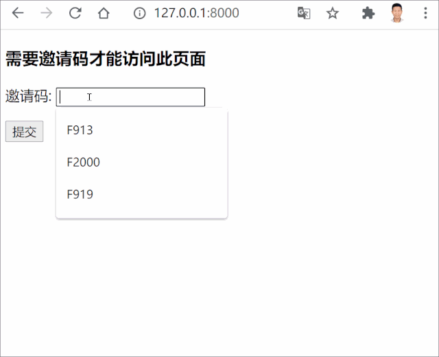
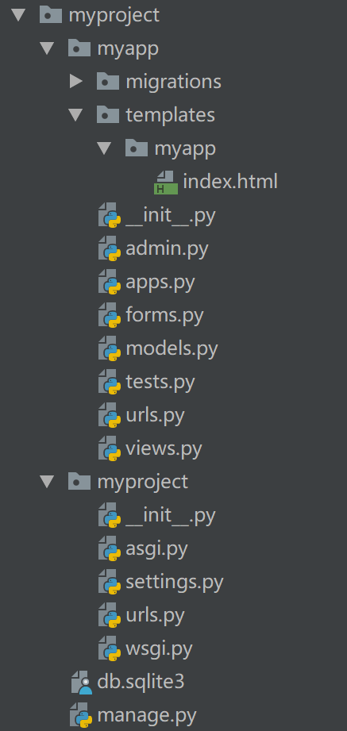

# Django实战：使用session实现用户免登录凭邀请码访问网页
{: .no_toc }

## 目录
{: .no_toc .text-delta }

1. TOC
{:toc}

---
有读者问如何利用Django开发这样一个权限功能：用户不用登录凭邀请码即可访问特定内容，且每次邀请码验证成功后还需要限制用户的访问时间。今天小编我就来分享下如何利用session实现这个需求。文末附有源码地址，使用Django 3.1开发，适合新人拿django的session框架练手。
{: .fs-6 .fw-300 }

## 实现原理

每当用户访问一个url，先判断用户的ip地址是不是已经在`request.session`里。如果不在，则展示要求用户输入有效的邀请码的表单，验证通过后把用户ip记录在session里，并跳转到访问内容页面。

最后实现效果如下所示：



## 第一步 创建项目和APP

首先我们创建一个名为`myproject`的项目, app名为`myapp`，整个项目目录结构如下所示：



然后打开项目的`settings.py`, 把myapp加入到INSTALLED_APP中去。

```python
INSTALLED_APPS = [
    'django.contrib.admin',
    'django.contrib.auth',
    'django.contrib.contenttypes',
    'django.contrib.sessions',
    'django.contrib.messages',
    'django.contrib.staticfiles',
    'myapp',
]
```


因为本例中我们要使用session，请确保settings.py中的INSTALLED_APP中包括了`django.contrib.sessions`, 中间件包括了`SessionMiddlewar`e。另外我们还需要设置下SESSION_ENGINE, 本例中使用django自带的sqlite3存储session，当然你还可以使用缓存或者文件存储session。

```python
SESSION_ENGINE = 'django.contrib.sessions.backends.db'
```


如果你对中间件或session不了解的，可以先阅读如下两篇文章：

- https://pythondjango.cn/django/basics/13-cookies-session/
- https://pythondjango.cn/django/advanced/9-middleware/

另外我们还需要编辑`myproject/urls.py`，把myapp对应的urls也加进去。

```python
from django.contrib import admin
from django.urls import path, include

urlpatterns = [
    path('admin/', admin.site.urls),
    path('', include("myapp.urls"))
]
```


## 第二步 创建模型

本例中我们只需创建一个非常简单模型，名为`InvitationCode`。它包括两个字段，字符串代码和过期时间，如下所示：
```python
#myapp/models.py

from django.db import models


# Create your models here.
class InvitationCode(models.Model):
    code = models.CharField(verbose_name="邀请码", max_length=10, unique=True)
    expire = models.DateTimeField(verbose_name="过期时间")


    def __str__(self):
        return self.code
```
为了通过django自带的admin对邀请码进行管理，我们还需修改`myapp/admin.py`, 添加如下代码：

```python
#myapp/admin.py

from django.contrib import admin
from .models import InvitationCode
# Register your models here.
class InvitationCodeAdmin(admin.ModelAdmin):
    list_display = ("code", "expire")


    class Meta:
        model = InvitationCode

 

admin.site.register(InvitationCode, InvitationCodeAdmin)
```
## 第三步 编写urls和视图

我们将编写两个路由urls，对应两个视图函数，一个用于邀请码验证，验证成功后使用session记录用户ip并跳转主页面; 另一个判断用户ip地址是否已经在session里，然后根据这个判断来决定渲染访问内容还是让用户输入邀请码的表单。
```python
# myapp/urls.py
from django.urls import path
from . import views

app_name = "myapp"
urlpatterns = [
    path('', views.index, name="index"),
    path('verify', views.code_verify, name="code_verify"),
]
```
路由对应视图函数如下所示：
```python
# myapp/views.py
from django.shortcuts import render, redirect
from .models import InvitationCode
from .forms import InvitationCodeForm
from django.utils.timezone import now
from django.contrib import messages


# 获取用户IP地址
def get_client_ip(request):
    x_forwarded_for = request.META.get('HTTP_X_FORWARDED_FOR')
    if x_forwarded_for:
        ip = x_forwarded_for.split(',')[0]
    else:
        ip = request.META.get('REMOTE_ADDR')
    return ip


# 验证用户邀请码。邀请码正确则以用户IP设为session key，值True，会话持续60秒
def code_verify(request):
    session_key = "user_ip_{}".format(get_client_ip(request))
    if request.method == "POST":
        code = request.POST.get("code", "")
        code_obj = InvitationCode.objects.filter(code=code, expire__gt=now()).first()
        if code_obj:
            request.session[session_key] = True
            request.session.set_expiry(60) # 会话有效时间60秒。60秒后需重新提交邀请码。
            messages.add_message(request, messages.SUCCESS, '恭喜你已成功通过验证码验证。本次会话60秒有效。')
        else:
            messages.add_message(request, messages.WARNING, '你的邀请码错误或已经过期。请重新输入。')
            if session_key in request.session:
                del request.session[session_key]


    return redirect("/") # 跳转到index页面

# 需要有效会话才能访问内容页面，否则展示输入邀请码的表单
def index(request):
    session_key = "user_ip_{}".format(get_client_ip(request))
    # 如果用户IP地址在session里，且值为True则展示隐藏内容
    if session_key in request.session and request.session[session_key]:
        return render(request, "myapp/index.html")
    else:
        form = InvitationCodeForm()
        return render(request, "myapp/index.html", {"form": form,})
```
我们先获取用户ip地址，并用其构建session的key。如果用户输入的邀请码有效且还未过期，我们设置`request.session[session_key] = True`，然后在index页面里进行判断。

index视图函数中我们使用到了`InvitationCodeForm`表单，它的代码如下所示：

```python
# myapp/forms.py
from django import forms
from .models import InvitationCode

class InvitationCodeForm(forms.ModelForm):
    class Meta:
        model = InvitationCode
        fields = ("code",)
```
## 第四步 编辑模板

虽然我们使用到了两个视图函数，但本例中只需一个模板展示index页面，这是因为code_verify视图函数只用于业务数据处理和页面跳转。

我们使用的模板`index.html`路径及代码如下所示：
```html

# myapp/templates/myapp/index.html
<!DOCTYPE html>
<html lang="en">
<head>
    <meta charset="UTF-8">
    <title>Django Session例子</title>
</head>
<body>
<h3>需要邀请码才能访问此页面</h3>

<ul class="messages">
    
    <li class="{{ message.tags }}">{{ message }}</li>
    
</ul>

 

<form action="" method="POST">
    
    {{ form.as_p }}
    <button type="submit">提交</button>
</form>

    <p>这部分属于隐藏内容。如果你能看到这个内容，说明你邀请码正确且会话未过期。</p>


</body>
</html>

```
到此我们整个项目的代码就写完了，是不是很简单?输入下面命令，就可以看到文章开始的动图效果啦。

```python
python manage.py makemigrations
python manage.py migrate
python manage.py createsuperuser
python manage.py runserver
```


项目源码地址：

- https://github.com/shiyunbo/django-session-example


原创不易，转载请注明来源。我是大江狗，一名Django技术开发爱好者。您可以通过搜索【<a href="https://blog.csdn.net/weixin_42134789">CSDN大江狗</a>】、【<a href="https://www.zhihu.com/people/shi-yun-bo-53">知乎大江狗</a>】和搜索微信公众号【Python Web与Django开发】关注我！


