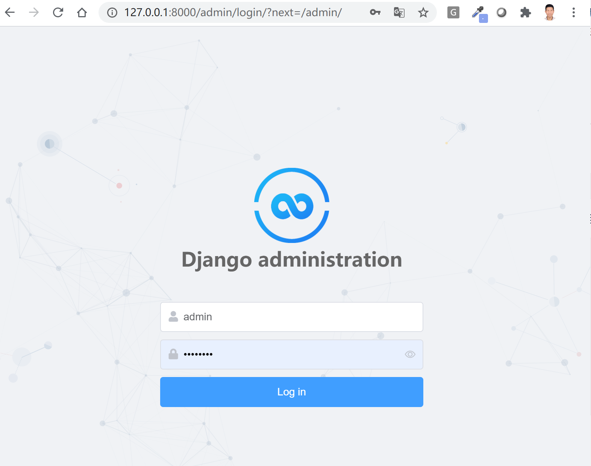
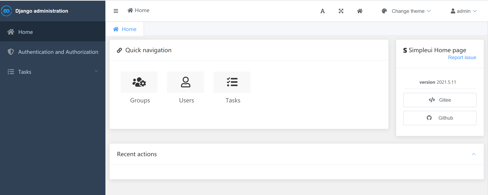
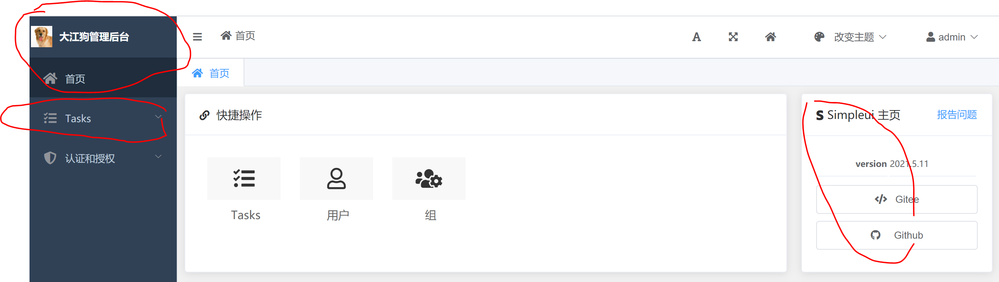
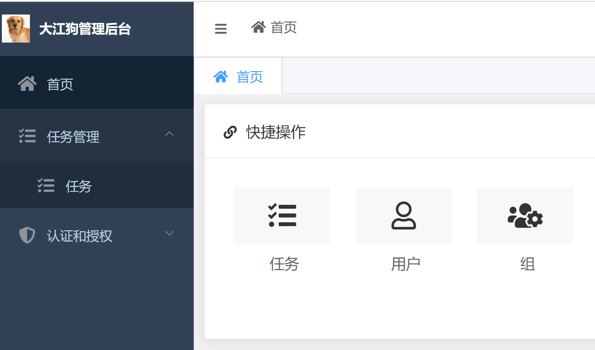
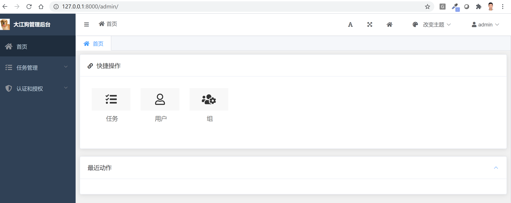
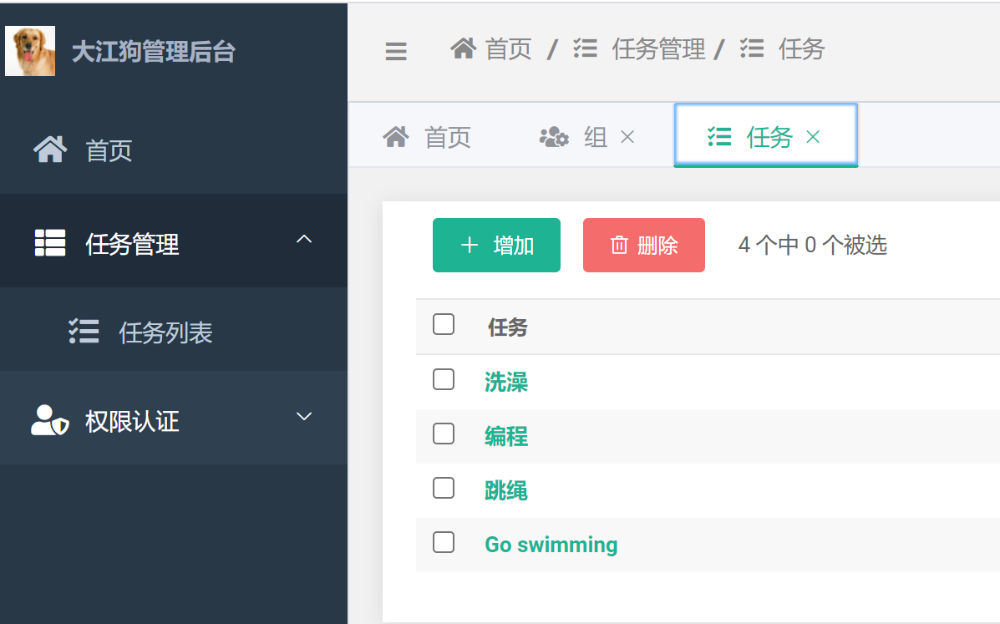
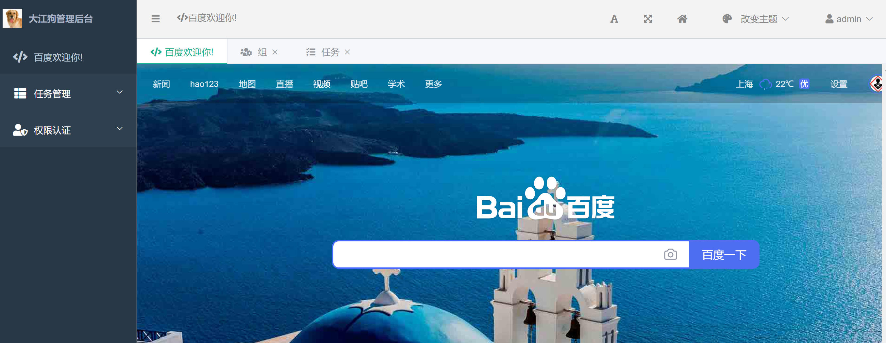
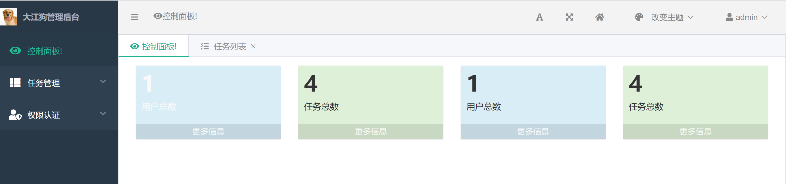

# 手把手教你使用Django SimpleUI打造美丽后台
很多人对Django自带的管理后台admin是又爱又恨，优点是几行代码配置就可以撸出一个功能性强的管理后台，缺点就是不怎么美观，感觉拿不出手。在所有的Django后台美化插件中，SimpleUI处于第一阵营，非常符合国人的审美观。本文将手把手教你如何配置使用Simple UI。
{: .fs-6 .fw-300 }

{: .no_toc }

## 目录
{: .no_toc .text-delta }

1. TOC
{:toc}

---

## 安装
### 第一步 pip安装并加入INSTALLED_APPS
```bash
pip install django-simpleui
```
修改`settings.py`, 将`simpleui`加入到`INSTALLED_APPS`里去，放在第一行，也就是django自带admin的前面。
```python
INSTALLED_APPS = [
      'simpleui', # 注意这里
      'django.contrib.admin',
      'django.contrib.auth',
      'django.contrib.contenttypes',
      'django.contrib.sessions',
      'django.contrib.messages',
      'django.contrib.staticfiles',
      ...     
]
```

### 第二步 测试是否安装成功

使用`python manage.py runserver`命令启动本地测试服务器, 访问`/admin/`, 如果你能看到如下页面说明安装成功。




登录后你还将看到如下用户界面：



注意：如果你在生成环境中使用SimpleUI，还需要使用`python manage.py collectstatic`命令收集静态文件，否则样式无法正常显示。

## 常用配置

### 设置语言, 去Logo和管理后台名字

当你看到以上界面时，首先你想改动的一定是语言，去掉SimpleUI的默认logo，并把`Django administration`改成比如某某管理后台的名字。

修改`settings.py`， 添加如下代码：

```python
# 更改默认语言为中文
LANGUAGE_CODE = 'zh-hans'

# 去掉默认Logo或换成自己Logo链接
SIMPLEUI_LOGO = 'https://th.bing.com/th/id/R2411a2b340731d67dfa0d84503e915e3?rik=zmYce%2fLys72JVQ&pid=ImgRaw' 
```

修改管理后台的名称和标题要稍微复杂些，因为你不能在`settings.py`里进行配置。在任何一个app的目录下新建一个`admin.py`, 添加如下代码即可修改(本例app名为tasks)。这个设置属于Django的设置，不属于SimpleUI的设置。

```python
# tasks/admin.py
from django.contrib import admin

admin.site.site_header = '大江狗管理后台'  # 设置header
admin.site.site_title = '大江狗管理后台'   # 设置title
admin.site.index_title = '大江狗管理后台'

from .models import Task
admin.site.register(Task)
```

登录后的效果如下所示：



现在你可以看到语言、Logo和管理后台名字都已经改过来了。但是你会发现两个问题，左侧菜单的tasks显示的依然是英文，我们需要将其设置成中文。另外，右侧有simpleui的广告链接，页面背后有js文件跟踪simpleui的使用，这些都需要关闭。我们接下来教你如何解决这两个问题。

### 自定义或第三方APP名和模型名修改成中文

修改`tasks/app.py`, 通过`verbose_name`可以将app名改为中文，这里将`tasks` 改成了`任务管理`。

```python
from django.apps import AppConfig

class TasksConfig(AppConfig):
    name = 'tasks'

    verbose_name = '任务管理'
```

接着修改`tasks/models.py`, 设置模型的`verbose_name`, 如下所示：

```python
from django.db import models

class Status(models.TextChoices):
    UNSTARTED = 'u', "Not started yet"
    ONGOING = 'o', "Ongoing"
    FINISHED = 'f', "Finished"


class Task(models.Model):
    name = models.CharField(verbose_name="Task name", max_length=65, unique=True)
    status = models.CharField(verbose_name="Task status", max_length=1, choices=Status.choices)
    
    class Meta:
        verbose_name = "任务"
        verbose_name_plural = "任务"

    def __str__(self):
        return self.name

```

现在刷新页面，你将看到tasks英文都变成中文了。



实际Django开发中，我们还会用到第三方应用app和第三方app提供的模型，我们也可以通过打补丁的方式更改第三方app或模型以及模型字段的`verbose_name`或者`label`，将其修改成中文，如下所示：

```
from third_package.models import ModelA

ModelA._meta.verbose_name = ''
ModelA._meta.verbose_name_plural = ''
ModelA._meta.get_field('first_name').verbose_name = '名字'
```

### 关闭右侧广告链接和使用分析

修改`settings.py`, 添加如下两行代码：

```python
# 隐藏右侧SimpleUI广告链接和使用分析
SIMPLEUI_HOME_INFO = False 
SIMPLEUI_ANALYSIS = False 
```

现在查看效果，是不是清爽多了?



实际上首页的快捷操作和最近动作也可以关闭，在自定义首页部分我们会讲到。

### 设置默认主题

SimpleUI默认主题(default)是深蓝色的，它支持的主题有`Element-ui`, `Admin Lte`和`Layui`等多种风格。你可以通过右上角下拉菜单改变主题，也可以在`settings.py`中设置默认主题，如下所示：

```python
# 设置默认主题，指向主题css文件名。Admin Lte风格
SIMPLEUI_DEFAULT_THEME = 'admin.lte.css'

# 设置默认主题，指向主题css文件名。Element-ui风格
SIMPLEUI_DEFAULT_THEME = 'element.css'

# 设置默认主题，指向主题css文件名。layui风格
SIMPLEUI_DEFAULT_THEME = 'layui.css'

# 设置默认主题，指向主题css文件名。紫色风格
SIMPLEUI_DEFAULT_THEME = 'purple.css'
```

### 自定义菜单

左侧可折叠菜单是Simple UI系统默认菜单，根据已注册的应用和模型自动生成，其中父级菜单是App名，子菜单一般是所属App的各个模型名。SimpleUI甚至会自动为你分配默认图标，比如本例的tasks的应用使用了font-awsome的`fa fa-tasks`。在大多数情况下，Simple UI系统默认菜单不能满足需求，这时你就需要自定义菜单了，比如添加新的选项或给菜单选项分配新的图标。

修改`settings.py`, 添加如下代码：

```python
SIMPLEUI_CONFIG = {
     # 是否使用系统默认菜单。
    'system_keep': False,
    
     # 用于菜单排序和过滤, 不填此字段为默认排序和全部显示。 空列表[] 为全部不显示.
    'menu_display': ['任务管理', '权限认证'],
    
    # 设置是否开启动态菜单, 默认为False. 如果开启, 则会在每次用户登陆时刷新展示菜单内容。
    # 一般建议关闭。
    'dynamic': False,
    'menus': [
        {
            'app': 'auth',
            'name': '权限认证',
            'icon': 'fas fa-user-shield',
            'models': [
                {
                'name': '用户列表',
                'icon': 'fa fa-user',
                'url': 'auth/user/'
                },
                {
                    'name': '用户组',
                    'icon': 'fa fa-th-list',
                    'url': 'auth/group/'
                }
            ]
        },

        {
            'name': '任务管理',
            'icon': 'fa fa-th-list',
            'models': [
                {
                'name': '任务列表',
                # 注意url按'/admin/应用名小写/模型名小写/'命名。  
                'url': '/admin/tasks/task/',
                'icon': 'fa fa-tasks'
                },
            ]
        },
    ]
}
```

自定义菜单效果如下所示。我们更改了SimpleUI默认分配的图标。你还可以随意增减菜单选项并对其进行排序。



当然使用SimpleUI系统菜单也有优点，比如用户拥有什么模型的权限就显示什么菜单。自定义menus中输出的菜单不会受权限控制。如果你想要在后台使用基于RBAC控制的菜单，就不要通过`SIMPLEUI_CONFIG`自定义菜单。如果你不喜欢，系统默认的菜单图标，只需要通过`SIMPLEUI_ICON`定义即可，如下所示：

```python
# 注意key名为菜单上实际显示的名字，不是模型或App名。
SIMPLEUI_ICON = {
    '任务管理': 'fas fa-tasks',
    '任务': 'fas fa-th-list',
}
```

### 自定义首页

SimpleUI默认首页由快捷链接和最近动作组成，我们可以将其隐藏，并将其链接到其它url。

继续修改`settings.py`, 添加如下代码：

```python
# 隐藏首页的快捷操作和最近动作
SIMPLEUI_HOME_QUICK = False 
SIMPLEUI_HOME_ACTION = False

# 修改左侧菜单首页设置
SIMPLEUI_HOME_PAGE = 'https://www.baidu.com'  # 指向页面
SIMPLEUI_HOME_TITLE = '百度欢迎你!' # 首页标题
SIMPLEUI_HOME_ICON = 'fa fa-code' # 首页图标

# 设置右上角Home图标跳转链接，会以另外一个窗口打开
SIMPLEUI_INDEX = 'https://www.baidu.com'
```

展示效果将如下所示：



实际应用中后台首页通常是控制面板，需要用图表形式展示各种关键数据，这时就需要重写首页了。这里主要有两种实现方法。第一种是重写simpleui自带的`home.html`, 另一种自己编写一个控制面板的页面，然后设置首页指向它, 个人倾向于第二种, 因为它完全不涉及改动simpleui的源码。

我们现在开始使用Django编写一个用于显示控制面板的页面，用于在首页显示注册用户数量及任务数量。URL路由及对应的视图函数如下所示：

```python
# tasks/urls.py
urlpatterns = [
    path('tasks/dashboard/', views.dashboard, name='dashboard'),
]

# tasks/views.py
from django.contrib.auth.models import User
from django.shortcuts import render
from .models import Task

def dashboard(request):
    user_count = User.objects.count()
    task_count = Task.objects.count()

    context = { 'user_count': user_count, 'task_count': task_count }
    return render(request, 'tasks/dashboard.html',context)
```

我们的模板也很简单，使用了boostrap4的admin lte风格的卡片展示用户总数和任务总数。

```html

<!DOCTYPE html>
<html>
<head>
  <meta charset="utf-8">
  <meta http-equiv="X-UA-Compatible" content="IE=edge">
  <title>控制面板</title>
  <!-- Tell the browser to be responsive to screen width -->
  <meta name="viewport" content="width=device-width, initial-scale=1">
  <!-- Theme style -->
    <link rel="stylesheet" href="https://adminlte.io/themes/AdminLTE/bower_components/bootstrap/dist/css/bootstrap.min.css">
  <link rel="stylesheet" href="https://adminlte.io/themes/AdminLTE/dist/css/AdminLTE.min.css">
</head>

<body>
<div class="wrapper">
 <!-- Main content -->
    <section class="content">
      <div class="container-fluid">
        <!-- Small boxes (Stat box) -->
        <div class="row">
          <div class="col-sm-3">
            <!-- small box -->
            <div class="small-box bg-info">
              <div class="inner">
                <h3>{{ user_count }}</h3>

                <p>用户总数</p>
              </div>
              <div class="icon">
                <i class="ion ion-bag"></i>
              </div>
              <a href="#" class="small-box-footer">更多信息 <i class="fas fa-arrow-circle-right"></i></a>
            </div>
          </div>
          <!-- ./col -->
          <div class="col-sm-3">
            <!-- small box -->
            <div class="small-box bg-success">
              <div class="inner">
                <h3>{{ task_count }}</h3>
                <p>任务总数</p>
              </div>
              <div class="icon">
                <i class="ion ion-stats-bars"></i>
              </div>
              <a href="#" class="small-box-footer">更多信息 <i class="fas fa-arrow-circle-right"></i></a>
            </div>
          </div>
          <!-- ./col -->
             <div class="col-sm-3">
            <!-- small box -->
            <div class="small-box bg-info">
              <div class="inner">
                <h3>{{ user_count }}</h3>

                <p>用户总数</p>
              </div>
              <div class="icon">
                <i class="ion ion-bag"></i>
              </div>
              <a href="#" class="small-box-footer">更多信息 <i class="fas fa-arrow-circle-right"></i></a>
            </div>
          </div>
          <!-- ./col -->
          <div class="col-sm-3">
            <!-- small box -->
            <div class="small-box bg-success">
              <div class="inner">
                <h3>{{ task_count }}</h3>

                <p>任务总数</p>
              </div>
              <div class="icon">
                <i class="ion ion-stats-bars"></i>
              </div>
              <a href="#" class="small-box-footer">更多信息 <i class="fas fa-arrow-circle-right"></i></a>
            </div>
          </div>
          <!-- ./col -->

        </div>
      </div>
    </section>
  </div>
</body> 
```

现在修改我们的`settings.py`, 将首页指向这个新创建的控制面板。

```python
# 修改首页设置, 指向新创建的控制面板
SIMPLEUI_HOME_PAGE = '/tasks/dashboard/'
SIMPLEUI_HOME_TITLE = '控制面板!' 
SIMPLEUI_HOME_ICON = 'fa fa-eye'
```

刷新浏览器，你就会发现我们的首页已经修改了，是不是很酷?



### 其它常见配置

```python
# 离线模式。不填该项或者为False的时候，默认从第三方的cdn获取
SIMPLEUI_STATIC_OFFLINE = False
# 关闭Loading遮罩层
SIMPLEUI_LOADING = False
# 关闭登录界面粒子动画
SIMPLEUI_LOGIN_PARTICLES = False
```

本文原创，转载请注明来源。我是大江狗，一名Django技术开发爱好者。您可以通过搜索【<a href="https://blog.csdn.net/weixin_42134789">CSDN大江狗</a>】、【<a href="https://www.zhihu.com/people/shi-yun-bo-53">知乎大江狗</a>】和搜索微信公众号【Python Web与Django开发】关注我！