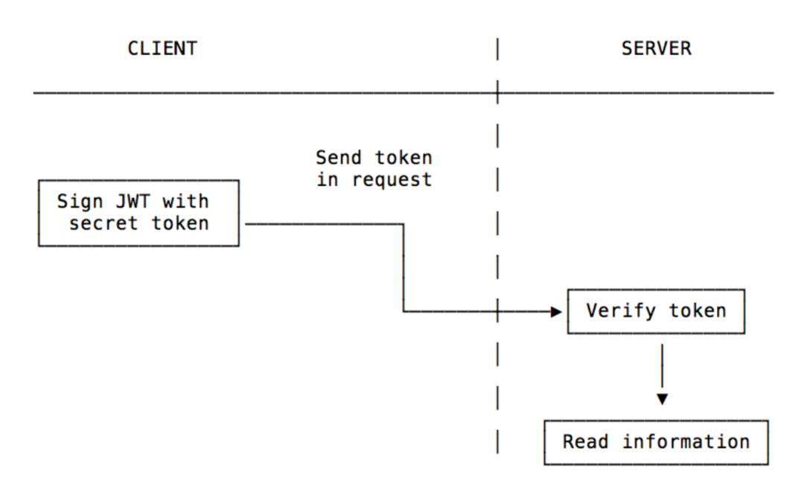
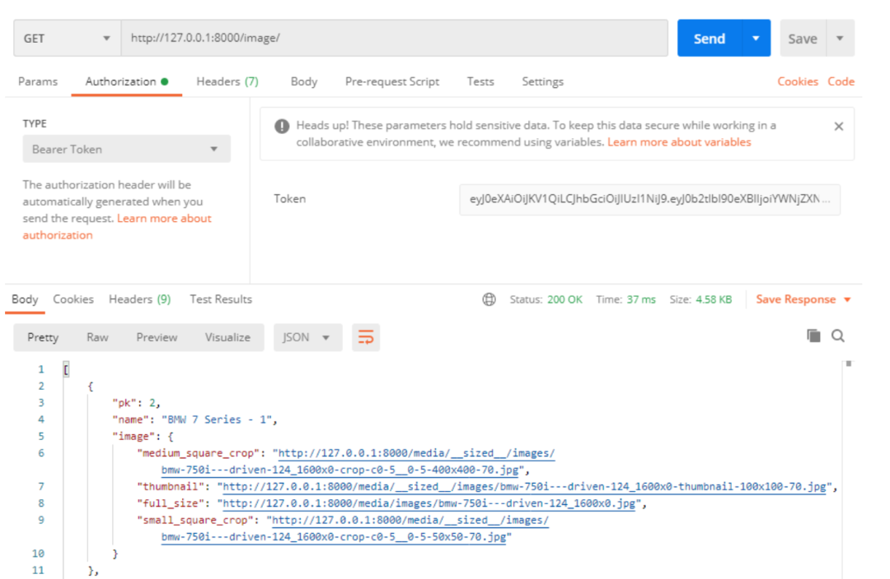
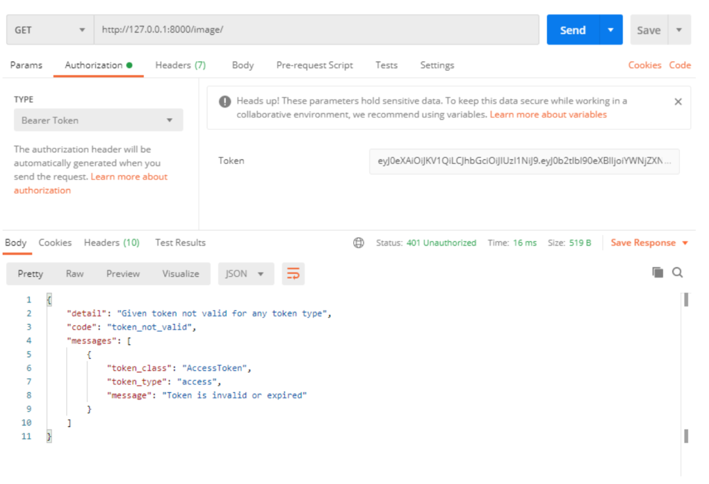
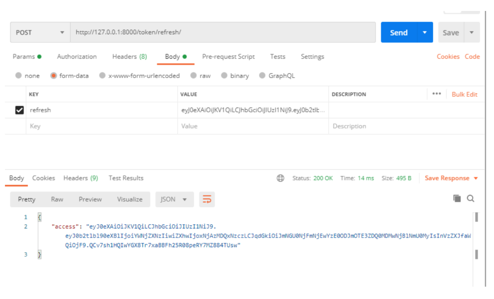
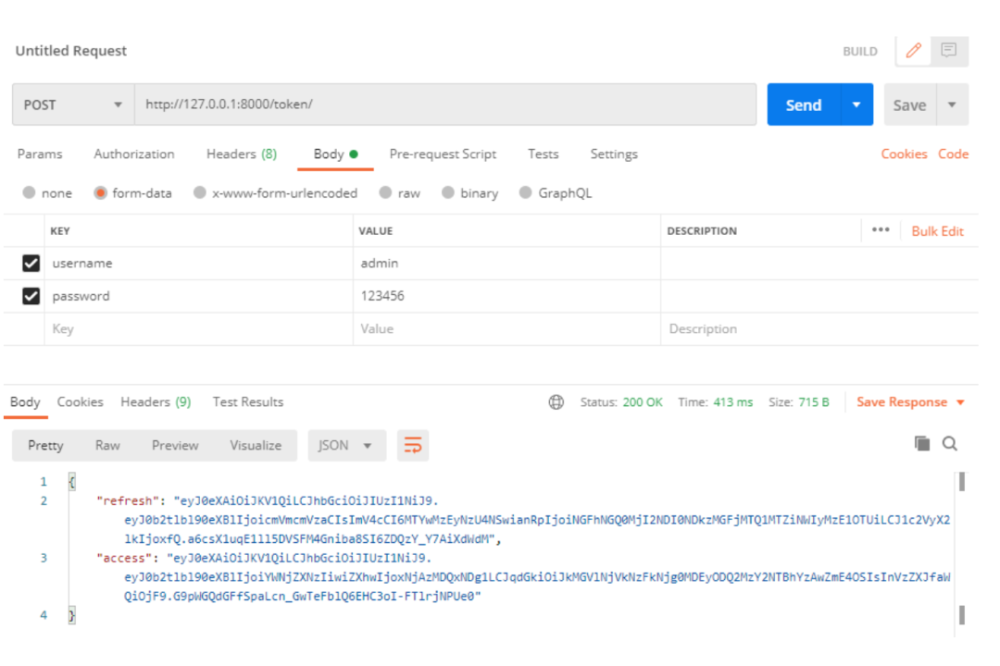
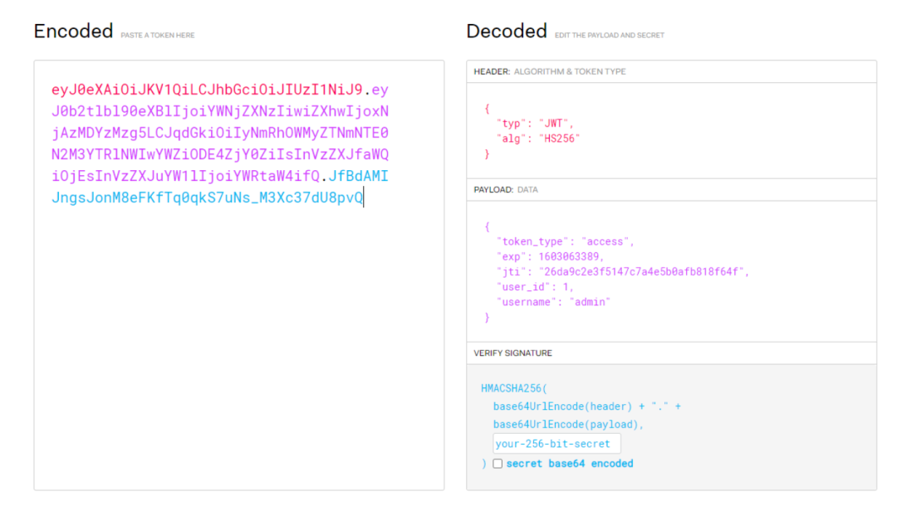

# JWT认证
{: .no_toc }

## 目录
{: .no_toc .text-delta }

1. TOC
{:toc}

---

在前面的DRF系列文章中，我们介绍了DRF认证(authentication)的本质, 以及自带的几种认证方案，包括TokenAuthentication。然而JSON Web Token(JWT)是一种更新的使用token进行身份认证的标准。与DRF内置的TokenAuthentication方案不同，JWT身份验证不需要使用数据库来验证令牌, 而且可以轻松设置token失效期或刷新token, 是API开发中当前最流行的跨域认证解决方案。本文将详细介绍JWT认证的工作原理以及如何通过`djangorestframework-simplejwt` 这个第三方包轻松实现JWT认证。
{: .fs-6 .fw-300 }

如果有一篇文章我敢拍胸脯说，你今天可能用不到，但总有一天你会需要回过头来阅读它并使用它，那么我指的就是本文，强烈建议先收藏再阅读。其实网上已经有不少关于JWT的文章，大同小异。为了避免重复造轮子，本文将以翻译国外medium.com上的一篇神文为主 (原作：**Yunus Emre Cevik**）并辅以自己的解读，希望对你有所帮助(原文链接：https://medium.com/django-rest/django-rest-framework-jwt-authentication-94bee36f2af8)。

## 什么是Json Web Token?
JSON Web Token（JWT）是一种开放标准，它定义了一种紧凑且自包含的方式，用于各方之间安全地将信息以JSON对象传输。由于此信息是经过数字签名的，因此可以被验证和信任。JWT用于为应用程序创建访问token，通常适用于API身份验证和服务器到服务器的授权。那么如何理解紧凑和自包含这两个词的含义呢?

- **紧凑**：就是说这个数据量比较少，可以通过url参数，http请求提交的数据以及http header多种方式来传递。
- **自包含**：这个字符串可以包含很多信息，比如用户id，用户名，订单号id等，如果其他人拿到该信息，就可以拿到关键业务信息。

那么JWT认证是如何工作的呢? 首先客户端提交用户登录信息验证身份通过后，服务器生成一个用于证明用户身份的令牌(token)，也就是一个加密后的长字符串，并将其发送给客户端。在后续请求中，客户端以各种方式(比如通过url参数或者请求头)将这个令牌发送回服务器，服务器就知道请求来自哪个特定身份的用户了。



JSON Web Token由三部分组成，这些部分由点（.）分隔，分别是header(头部)，payload(有效负载)和signature(签名)。

- **header(头部)**: 识别以何种算法来生成签名；
- **pyload(有效负载)**: 用来存放实际需要传递的数据；
- **signature(签名):** 安全验证token有效性，防止数据被篡改。

通过http传输的数据实际上是加密后的JWT，它是由两个点分割的base64-URL长字符串组成，解密后我们可以得到header, payload和signature三部分。我们可以简单的使用 https://jwt.io/ 官网来生成或解析一个JWT，如下所示：


接下来我们将使用django-rest-framework-simplejwt这个第三方软件包进行JWT身份验证。

## DRF中如何使用JWT认证
### 安装
django-rest-framework-simplejwt为Django REST Framework提供了JSON Web Token认证后端。它提供了一组保守的默认功能来涵盖了JWT的最常见用例，而且非常容易扩展。

**首先**，我们要使用pip安装它。

```bash
pip install djangorestframework-simplejwt
```

**其次**，我们需要告诉DRF我们使用jwt认证作为后台认证方案。修改`apiproject/settings.py`：

```python
REST_FRAMEWORK = {
    'DEFAULT_AUTHENTICATION_CLASSES': [
        'rest_framework_simplejwt.authentication.JWTAuthentication',
    ],
}
```

**最后**，我们需要提供用户可以获取和刷新token的urls地址，这两个urls分别对应`TokenObtainPairView`和`TokenRefreshView`两个视图。

```python
from django.contrib import admin
from django.urls import path, include
from reviews.views import ProductViewSet, ImageViewSet
from rest_framework.routers import DefaultRouter
from django.conf import settings
from django.conf.urls.static import static
from rest_framework_simplejwt.views import (
    TokenObtainPairView,
    TokenRefreshView,
)


router = DefaultRouter()
router.register(r'product', ProductViewSet, basename='Product')
router.register(r'image', ImageViewSet, basename='Image')


urlpatterns = [
    path('admin/', admin.site.urls),
    path('token/', TokenObtainPairView.as_view(), name='token_obtain_pair'),
    path('token/refresh/', TokenRefreshView.as_view(), name='token_refresh'),
    path('', include(router.urls)),
]


if settings.DEBUG:
    urlpatterns += static(settings.MEDIA_URL, document_root=settings.MEDIA_ROOT)
```
### 测试
现在我们可以开始使用postman测试了。通过POST方法发送登录请求到/token/, 请求数据包括username和password。如果登录成功，你将得到两个长字符串，一个是access token(访问令牌)，还有一个是refresh token(刷新令牌)，如下所示：


假如你有一个受保护的视图(比如这里的/image/)，权限(permission_classes)是`IsAuthenticated`，只有验证用户才可访问。访问这个保护视图时你只需要在请求头的Authorization选项里输入你刚才获取的access token即可，如下所示：



不过这个access token默认只有5分钟有效。5分钟过后，当你再次访问保护视图时，你将得到如下token已失效或过期的提示：



去获取新的access token，你需要使用之前获得的refresh token。你将这个refresh token放到请求的正文(body)里，发送POST请求到`/token/refresh/`即可获得刷新后的access token(访问令牌), 如下所示：



那么问题来了，Simple JWT中的access token默认有效期是5分钟，那么refresh token默认有效期是多长呢? 答案是24小时。

## Simple JWT的默认设置

Simple JWT的默认设置如下所示：

```python
DEFAULTS = {
    'ACCESS_TOKEN_LIFETIME': timedelta(minutes=5),
    'REFRESH_TOKEN_LIFETIME': timedelta(days=1),
    'ROTATE_REFRESH_TOKENS': False,
    'BLACKLIST_AFTER_ROTATION': True,


    'ALGORITHM': 'HS256',
    'SIGNING_KEY': settings.SECRET_KEY,
    'VERIFYING_KEY': None,
    'AUDIENCE': None,
    'ISSUER': None,


    'AUTH_HEADER_TYPES': ('Bearer',),
    'USER_ID_FIELD': 'id',
    'USER_ID_CLAIM': 'user_id',


    'AUTH_TOKEN_CLASSES': ('rest_framework_simplejwt.tokens.AccessToken',),
    'TOKEN_TYPE_CLAIM': 'token_type',


    'JTI_CLAIM': 'jti',


    'SLIDING_TOKEN_REFRESH_EXP_CLAIM': 'refresh_exp',
    'SLIDING_TOKEN_LIFETIME': timedelta(minutes=5),
    'SLIDING_TOKEN_REFRESH_LIFETIME': timedelta(days=1),
}
```

如果要覆盖Simple JWT的默认设置，可以修改`settings.py`, 如下所示。下例将refresh token的有效期改为了15天。

```python
from datetime import timedelta


SIMPLE_JWT = {
    'REFRESH_TOKEN_LIFETIME': timedelta(days=15),
    'ROTATE_REFRESH_TOKENS': True,
}
```

## 自定义令牌(token)

如果你对Simple JWT返回的access token进行解码，你会发现这个token的payload数据部分包括token类型，token失效时间，jti(一个类似随机字符串）和user_id。如果你希望在payload部分提供更多信息，比如用户的username，这时你就要自定义令牌(token)了。


**首先**，编写你的`myapp/seralizers.py`，添加如下代码。该序列化器继承了`TokenObtainPairSerializer`类。

```python
from rest_framework_simplejwt.serializers import TokenObtainPairSerializer

class MyTokenObtainPairSerializer(TokenObtainPairSerializer):
    @classmethod
    def get_token(cls, user):
        token = super(MyTokenObtainPairSerializer, cls).get_token(user)

        # 添加额外信息
        token['username'] = user.username
        return token
```

**其次**，不使用Simple JWT提供的默认视图，使用自定义视图。修改   `myapp/views.py`, 添加如下代码：

```python
from rest_framework_simplejwt.views import TokenObtainPairView
from rest_framework.permissions import AllowAny
from .serializers import MyTokenObtainPairSerializer

class MyObtainTokenPairView(TokenObtainPairView):
    permission_classes = (AllowAny,)
    serializer_class = MyTokenObtainPairSerializer
```
**最后**，修改`apiproject/urls.py`, 添加如下代码，将/token/指向新的自定义的视图。注意：本例中的app名为reviews，所以是从reviews.views导入的`MyObtainTokenPairView`。

```python
from django.contrib import admin
from django.urls import path, include
from reviews.views import ProductViewSet, ImageViewSet, MyObtainTokenPairView
from rest_framework.routers import DefaultRouter
from django.conf import settings
from django.conf.urls.static import static
from rest_framework_simplejwt.views import TokenRefreshView

router = DefaultRouter()
router.register(r'product', ProductViewSet, basename='Product')
router.register(r'image', ImageViewSet, basename='Image')

urlpatterns = [
    path('admin/', admin.site.urls),
    path('token/', MyObtainTokenPairView.as_view(), name='token_obtain_pair'),
    path('token/refresh/', TokenRefreshView.as_view(), name='token_refresh'),
    path('', include(router.urls)),
]

if settings.DEBUG:
    urlpatterns += static(settings.MEDIA_URL, document_root=settings.MEDIA_ROOT)
```

重新发送POST请求到/token/，你将获得新的access token和refresh token，如下所示：



对重新获取的access token进行解码，你将看到payload部分多了username的内容，是不是很酷? 在实际API开发过程中，通过Json Web Token传递更多数据非常有用。



## 自定义认证后台(Backend)

上面的演示案例是通过用户名和密码登录的，如果我们希望后台同时支持邮箱/密码，手机/密码组合登录怎么办? 这时我们还需要自定义认证后台(Backend)。

**首先**，修改`users/views.py`, 添加如下代码：

```python
from django.contrib.auth.backends import ModelBackend
from django.db.models import Q
from django.contrib.auth import get_user_model


User = get_user_model()

class MyCustomBackend(ModelBackend):
    def authenticate(self, request, username=None, password=None, **kwargs):
        try:
            user = User.objects.get(Q(username=username) | Q(email=username) )
            if user.check_password(password):
                return user
        except Exception as e:
            return None
```

**其次**，修改`settings.py`, 把你自定义的验证方式添加到AUTHENTICATION_BACKENDS里去。

```python
AUTHENTICATION_BACKENDS = (
    'users.views.MyCustomBackend',
)
```

修改好后，你使用postman发送邮箱/密码组合到/token/，将同样可以获得access token和refresh token。是不是又学到了一招?

## 小结

本文讲解与演示的内容非常多，介绍了什么是JWT及其工作原理，演示了如何使用Simple JWT这个第三方安装包，如何自定义令牌(token)和认证后台(backend)。

到此对DRF的认证与权限部分我们就介绍完了，接下来我们将分别介绍分页、过滤、限流和解析器。


原创不易，转载请注明来源。我是大江狗，一名Django技术开发爱好者。您可以通过搜索【<a href="https://blog.csdn.net/weixin_42134789">CSDN大江狗</a>】、【<a href="https://www.zhihu.com/people/shi-yun-bo-53">知乎大江狗</a>】和搜索微信公众号【Python Web与Django开发】关注我！


