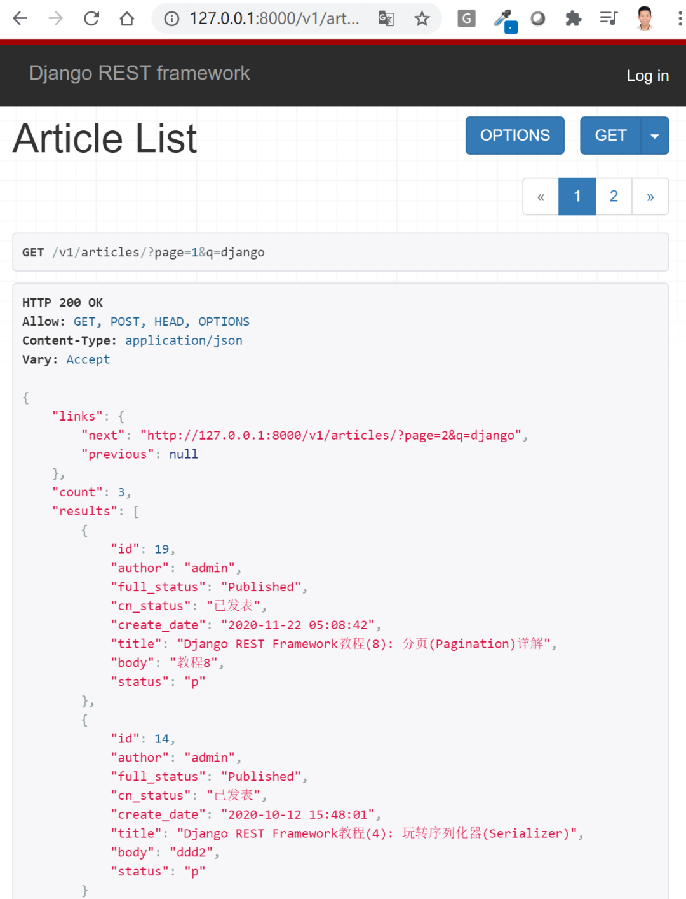
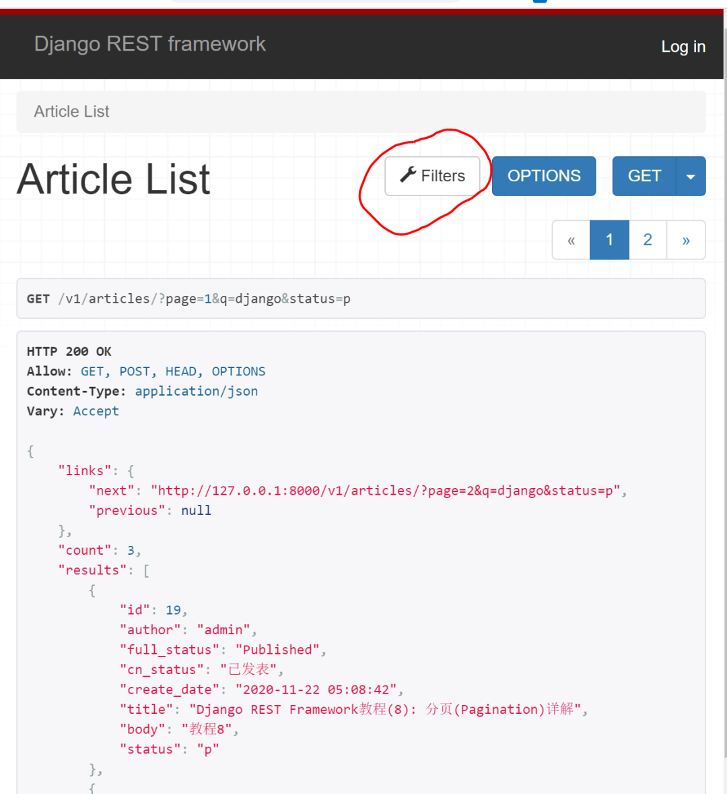
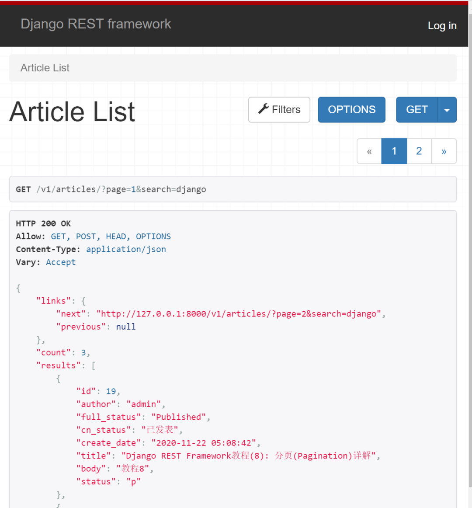

# 过滤与排序
{: .no_toc }

## 目录
{: .no_toc .text-delta }

1. TOC
{:toc}

---

在前面的DRF系列教程中，我们以博客为例介绍了序列化器(Serializer), 并使用基于类的视图APIView和ModelViewSet开发了针对文章资源进行增删查改的完整API端点，并详细对权限、认证(含jwt认证)和分页进行了总结与演示。在本篇文章中我们将向你演示如何在Django REST Framework中对分页结果进行进一步过滤和排序。
{: .fs-6 .fw-300 }


## 前情回顾

前面教程中当你发送GET请求到/v1/articles?page=2时可以得到下面返回的分页数据列表。现在我们希望对结果进行进一步过滤，比如返回标题含有关键词django的文章资源列表。我们到底该怎么做呢? 本例中小编我将演示三种过滤方法, 你可以根据实际项目开发需求去使用。


## 方法一: 重写get_queryset方法

此方法不依赖于任何第三方包, 只适合于需要过滤的字段比较少的模型。比如这里我们希望对文章title进行过滤，我们只需要修改ArticleList视图函数类即可。

```python
# blog/views.py

from rest_framework import generics
from rest_framework import permissions
from .permissions import IsOwnerOrReadOnly
from .pagination import MyPageNumberPagination


class ArticleList(generics.ListCreateAPIView):
    serializer_class = ArticleSerializer
    permission_classes = (permissions.IsAuthenticatedOrReadOnly,)
    pagination_class = MyPageNumberPagination


    def get_queryset(self):
        keyword = self.request.query_params.get('q')
        if not keyword:
            queryset = Article.objects.all()
        else:
            queryset = Article.objects.filter(title__icontains=keyword)
        return queryset


    # associate user with article author.
    def perform_create(self, serializer):
        serializer.save(author=self.request.user)
```
修改好视图类后，发送GET请求到/v1/articles?page=1&q=django, 你将得到所有标题含有django关键词的文章列表，这里显示一共有3条结果。



**注意**：DRF中你通过`request.query_params`获取GET请求发过来的参数，而不是request.GET。如果你希望获取从URL里传递的参数，你可以使用`self.kwargs['param1']`。

假如你的URL配置如下所示：

```python
re_path('^articles/(?P<username>.+)/$', AricleList.as_view()),
```

在视图中你可以通过`self.kwargs['username']`获取URL传递过来的用户名。

```python
class ArticleList(generics.ListAPIView):
    serializer_class = ArticleSerializer

    def get_queryset(self):
        """
        按用户名查询发表文章清单
        """
        username = self.kwargs['username']
        return Article.objects.filter(author__username=username)
```

当一个模型需要过滤的字段很多且不确定时(比如文章状态、正文等等), 重写get_queryset方法将变得非常麻烦，更好的方式是借助django-filter这个第三方库实现过滤。

## 方法二: 使用django-filter

`django-filter`库包含一个`DjangoFilterBackend`类，该类支持REST框架的高度可定制的字段过滤。这也是小编推荐的过滤方法, 因为它自定义需要过滤的字段非常方便, 还可以对每个字段指定过滤方法(比如模糊查询和精确查询)。具体使用方式如下：

### 安装django-filter

```bash
pip install django-filter
```

把`django_filters`添加到INSTALLED_APPS中去。

```python
INSTALLED_APPS = [
    ...,
    django_filters,
]
```

接下来你还需要把`DjangoFilterBackend`设为过滤后台。你可以在`settings.py`中进行全局配置。

```
REST_FRAMEWORK = {
    'DEFAULT_FILTER_BACKENDS': ['django_filters.rest_framework.DjangoFilterBackend']
}
```

还可以在单个视图中使用它。

```python
from django_filters import rest_framework

class ArticleList(generics.ListCreateAPIView):
  
    # new: filter backends and classes
    filter_backends = (rest_framework.DjangoFilterBackend,)

```

在类视图中使用django-filter时，你可以直接通过`filterset_fields`设置希望过滤的字段，如下所示：

```python
from django_filters import rest_framework

class ArticleList(generics.ListCreateAPIView):
  
    # new: filter backends and classes
    filter_backends = (rest_framework.DjangoFilterBackend,)
    filterset_fields = ['title', 'status']
```

如果你希望进行更多定制化的行为，你需要自定义FilterSet类，然后指定`filter_class`。

### 自定义FilterSet类

新建`blog/filters.py`, 添加如下代码：

```python
import django_filters
from .models import Article


class ArticleFilter(django_filters.FilterSet):
    q = django_filters.CharFilter(field_name='title', lookup_expr='icontains')


    class Meta:
        model = Article
        fields = ('title', 'status')
```

接下来通过`filter_class`使用它。

```properties
# New for django-filter
from django_filters import rest_framework
from .filters import ArticleFilter


class ArticleList(generics.ListCreateAPIView):
    queryset = Article.objects.all()
    serializer_class = ArticleSerializer
    permission_classes = (permissions.IsAuthenticatedOrReadOnly,)
    pagination_class = MyPageNumberPagination


    # new: filter backends and classes
    filter_backends = (rest_framework.DjangoFilterBackend,)
    filter_class = ArticleFilter

    # associate request.user with author.
    def perform_create(self, serializer):
        serializer.save(author=self.request.user)
```
发送GET请求到/v1/articles?page=2&q=django&status=p, 你将得到如下返回结果，只包含发表了的文章。



你还可以看到REST框架提供了一个新的Filters下拉菜单按钮，可以帮助您对结果进行过滤(见上图标红部分)。

## 方法三: 使用SearchFilter类

其实DRF自带了具有过滤功能的`SearchFilter`类，其使用场景与Django-filter的单字段过滤略有不同，更侧重于使用一个关键词对模型的某个字段或多个字段同时进行搜索。

使用这个类，你还需要指定`search_fields`, 具体使用方式如下：

```python
from rest_framework import filters

class ArticleList(generics.ListCreateAPIView):
    queryset = Article.objects.all()
    serializer_class = ArticleSerializer
    permission_classes = (permissions.IsAuthenticatedOrReadOnly,)
    pagination_class = MyPageNumberPagination

    # new: add SearchFilter and search_fields
    filter_backends = (filters.SearchFilter, )
    search_fields = ('title',)

    # associate request.user with author.
    def perform_create(self, serializer):
        serializer.save(author=self.request.user)
```

发送GET请求到/v1/articles?page=1&search=django, 你将得到如下结果。**注意**：这里进行搜索查询的默认参数名为?search=xxx。



SearchFilter类非常有用，因为它不仅支持对模型的多个字段进行查询，还支持ForeinKey和ManyToMany字段的关联查询。按如下修改`search_fields`, 就可以同时搜索标题或用户名含有某个关键词的文章资源列表。修改好后，作者用户名里如果有django，该篇文章也会包含在搜索结果了。

```python
search_fields = ('title', 'author__username')
```

默认情况下，SearchFilter类搜索将使用不区分大小写的部分匹配(icontains)。你可以在search_fields中添加各种字符来指定匹配方法。

- '^'开始 - 搜索。
- '='完全匹配。
- '@'全文搜索。
- '$'正则表达式搜索。

例如：search_fields = ('=title', )精确匹配title。

### 自定义SearchFilter类

默认SearchFilter类仅支持`?search=xxx`这个传递参数，你可以通过设置`SEARCH_PARAM`覆盖。另外你还可以重写`get_search_fileds`方法改变它的行为。下例中，当你按照/?search=keyword&title_only=True提交请求时，它将只针对title进行查询。

```python
from rest_framework import filters

class CustomSearchFilter(filters.SearchFilter):
    def get_search_fields(self, view, request):
        if request.query_params.get('title_only'):
            return ['title']
        return super(CustomSearchFilter, self).get_search_fields(view, request)
```

前面我们详细介绍了对结果进行过滤的3种方法，接下来我们再看看如何对结果进行排序，这里主要通过DRF自带的OrderingFilter类实现。

## 排序OrderingFilter类

使用`OrderingFilter`类首先要把它加入到`filter_backends`, 然后指定排序字段即可，如下所示：

```python
from rest_framework import filters

class ArticleList(generics.ListCreateAPIView):
    queryset = Article.objects.all()
    serializer_class = ArticleSerializer
    permission_classes = (permissions.IsAuthenticatedOrReadOnly,)
    pagination_class = MyPageNumberPagination

    filter_backends = (filters.SearchFilter, filters.OrderingFilter,)
    search_fields = ('title',)
    ordering_fields = ('create_date')
```

发送请求时只需要在参数上加上?ordering=create_date或者?ordering=-create_date即可实现对结果按文章创建时间正序和逆序进行排序。

点击DRF界面上的Filters按钮，你还会看到搜索和排序的选项。


**注意**：实际开发应用中OrderingFilter类，SearchFilter类和DjangoFilterBackend经常一起联用作为DRF的`filter_backends`，没有相互冲突。

## 小结
本文详细总结了Django REST Framework中如何对返回的响应数据进行过滤和排序，你都学到了吗? 接下来我们将介绍Django REST Framework的限流和自定义响应数据格式。


原创不易，转载请注明来源。我是大江狗，一名Django技术开发爱好者。您可以通过搜索【<a href="https://blog.csdn.net/weixin_42134789">CSDN大江狗</a>】、【<a href="https://www.zhihu.com/people/shi-yun-bo-53">知乎大江狗</a>】和搜索微信公众号【Python Web与Django开发】关注我！


