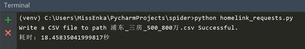
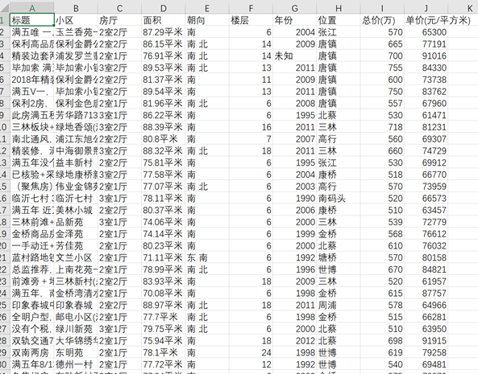
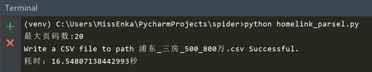
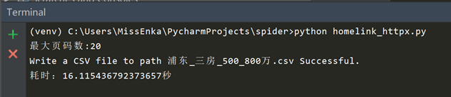
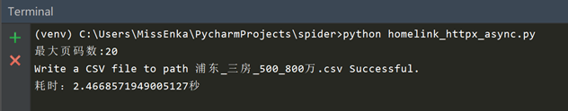
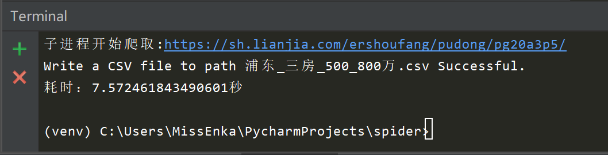
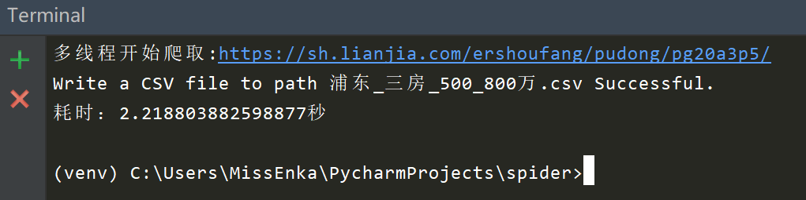

# Python爬虫下一代网络请求库httpx和parsel解析库测评
{: .no_toc }

## 目录
{: .no_toc .text-delta }

1. TOC
{:toc}

---
Python网络爬虫领域两个最新的比较火的工具莫过于httpx和parsel了。httpx号称下一代的新一代的网络请求库，不仅支持requests库的所有操作，还能发送异步请求。parsel最初集成在著名Python爬虫框架Scrapy中，后独立出来成立一个单独的模块，支持XPath选择器, CSS选择器和正则表达式等多种解析提取方式, 据说相比于BeautifulSoup解析效率更高。另外httpx异步协程与多进程和多线程爬虫相比到底谁更快呢?
{: .fs-6 .fw-300 }

今天我们就以爬取链家网上的二手房在售房产信息为例来好好测评下。为了节约时间，我们以爬取上海市浦东新区500万元-800万元以上的房产为例。本例不仅会给出一个客观的结论，还会教你如何写多进程，多线程和异步协程爬虫。

## requests + BeautifulSoup

首先上场的是`Requests + BeautifulSoup`组合，这也是大多数人刚学习Python爬虫时使用的组合。本例中爬虫的入口url是`https://sh.lianjia.com/ershoufang/pudong/a3p5/`, 先发送请求获取最大页数，然后循环发送请求解析单个页面提取我们所要的信息（比如小区名，楼层，朝向，总价，单价等信息)，最后导出csv文件。如果你正在阅读本文，相信你对Python爬虫已经有了一定了解，所以我们不会详细解释每一行代码。

整个项目代码如下所示：

```
# homelink_requests.py
# Author: 大江狗

from fake_useragent import UserAgent
import requests
from bs4 import BeautifulSoup
import csv
import re
import time


class HomeLinkSpider(object):
    def __init__(self):
        self.ua = UserAgent()
        self.headers = {"User-Agent": self.ua.random}
        self.data = list()
        self.path = "浦东_三房_500_800万.csv"
        self.url = "https://sh.lianjia.com/ershoufang/pudong/a3p5/"

    def get_max_page(self):
        response = requests.get(self.url, headers=self.headers)
        if response.status_code == 200:
            soup = BeautifulSoup(response.text, 'html.parser')
            a = soup.select('div[class="page-box house-lst-page-box"]')
            #使用eval是字符串转化为字典格式
            max_page = eval(a[0].attrs["page-data"])["totalPage"] 
            return max_page
        else:
            print("请求失败 status:{}".format(response.status_code))
            return None

    def parse_page(self):
        max_page = self.get_max_page()
        for i in range(1, max_page + 1):
            url = 'https://sh.lianjia.com/ershoufang/pudong/pg{}a3p5/'.format(i)
            response = requests.get(url, headers=self.headers)
            soup = BeautifulSoup(response.text, 'html.parser')
            ul = soup.find_all("ul", class_="sellListContent")
            li_list = ul[0].select("li")
            for li in li_list:
                detail = dict()
                detail['title'] = li.select('div[class="title"]')[0].get_text()

                #  2室1厅 | 74.14平米 | 南 | 精装 | 高楼层(共6层) | 1999年建 | 板楼
                house_info = li.select('div[class="houseInfo"]')[0].get_text()
                house_info_list = house_info.split(" | ")

                detail['bedroom'] = house_info_list[0]
                detail['area'] = house_info_list[1]
                detail['direction'] = house_info_list[2]

                floor_pattern = re.compile(r'\d{1,2}')
                # 从字符串任意位置匹配
                match1 = re.search(floor_pattern, house_info_list[4])  
                if match1:
                    detail['floor'] = match1.group()
                else:
                    detail['floor'] = "未知"

                # 匹配年份
                year_pattern = re.compile(r'\d{4}')
                match2 = re.search(year_pattern, house_info_list[5])
                if match2:
                    detail['year'] = match2.group()
                else:
                    detail['year'] = "未知"

                # 文兰小区 - 塘桥， 提取小区名和哈快
                position_info = li.select('div[class="positionInfo"]')[0].get_text().split(' - ')
                detail['house'] = position_info[0]
                detail['location'] = position_info[1]

                # 650万，匹配650
                price_pattern = re.compile(r'\d+')
                total_price = li.select('div[class="totalPrice"]')[0].get_text()
                detail['total_price'] = re.search(price_pattern, total_price).group()

                # 单价64182元/平米， 匹配64182
                unit_price = li.select('div[class="unitPrice"]')[0].get_text()
                detail['unit_price'] = re.search(price_pattern, unit_price).group()
                self.data.append(detail)

    def write_csv_file(self):
        head = ["标题", "小区", "房厅", "面积", "朝向", "楼层", "年份",
        "位置", "总价(万)", "单价(元/平方米)"]
        keys = ["title", "house", "bedroom", "area", "direction",
        "floor", "year", "location",
                "total_price", "unit_price"]

        try:
            with open(self.path, 'w', newline='', encoding='utf_8_sig') as csv_file:
                writer = csv.writer(csv_file, dialect='excel')
                if head is not None:
                    writer.writerow(head)
                for item in self.data:
                    row_data = []
                    for k in keys:
                        row_data.append(item[k])
                        # print(row_data)
                    writer.writerow(row_data)
                print("Write a CSV file to path %s Successful." % self.path)
        except Exception as e:
            print("Fail to write CSV to path: %s, Case: %s" % (self.path, e))


if __name__ == '__main__':
    start = time.time()
    home_link_spider = HomeLinkSpider()
    home_link_spider.parse_page()
    home_link_spider.write_csv_file()
    end = time.time()
    print("耗时：{}秒".format(end-start))
```

注意：我们使用了fake_useragent, requests和BeautifulSoup，这些都需要通过pip事先安装好才能用。

现在我们来看下爬取结果，耗时约18.5秒，总共爬取580条数据。





## requests + parsel组合

这次我们同样采用requests获取目标网页内容，使用parsel库(事先需通过pip安装)来解析。Parsel库的用法和BeautifulSoup相似，都是先创建实例，然后使用各种选择器提取DOM元素和数据，但语法上稍有不同。Beautiful有自己的语法规则，而Parsel库支持标准的css选择器和xpath选择器, 通过get方法或getall方法获取文本或属性值，使用起来更方便。

```python
# BeautifulSoup的用法
from bs4 import BeautifulSoup

soup = BeautifulSoup(response.text, 'html.parser')
ul = soup.find_all("ul", class_="sellListContent")[0]

# Parsel的用法, 使用Selector类
from parsel import Selector
selector = Selector(response.text)
ul = selector.css('ul.sellListContent')[0]

# Parsel获取文本值或属性值案例
selector.css('div.title span::text').get()
selector.css('ul li a::attr(href)').get()
>>> for li in selector.css('ul > li'):
...     print(li.xpath('.//@href').get())
```

注：老版的parsel库使用`extract()`或`extract_first()`方法获取文本或属性值，在新版中已被`get()`和`getall()`方法替代。

全部代码如下所示：

```python
# homelink_parsel.py
# Author: 大江狗

from fake_useragent import UserAgent
import requests
import csv
import re
import time
from parsel import Selector


class HomeLinkSpider(object):
    def __init__(self):
        self.ua = UserAgent()
        self.headers = {"User-Agent": self.ua.random}
        self.data = list()
        self.path = "浦东_三房_500_800万.csv"
        self.url = "https://sh.lianjia.com/ershoufang/pudong/a3p5/"

    def get_max_page(self):
        response = requests.get(self.url, headers=self.headers)
        if response.status_code == 200:
            # 创建Selector类实例
            selector = Selector(response.text)
            # 采用css选择器获取最大页码div Boxl
            a = selector.css('div[class="page-box house-lst-page-box"]')
            # 使用eval将page-data的json字符串转化为字典格式
            max_page = eval(a[0].xpath('//@page-data').get())["totalPage"]
            print("最大页码数:{}".format(max_page))
            return max_page
        else:
            print("请求失败 status:{}".format(response.status_code))
            return None

    def parse_page(self):
        max_page = self.get_max_page()
        for i in range(1, max_page + 1):
            url = 'https://sh.lianjia.com/ershoufang/pudong/pg{}a3p5/'.format(i)
            response = requests.get(url, headers=self.headers)
            selector = Selector(response.text)
            ul = selector.css('ul.sellListContent')[0]
            li_list = ul.css('li')
            for li in li_list:
                detail = dict()
                detail['title'] = li.css('div.title a::text').get()

                #  2室1厅 | 74.14平米 | 南 | 精装 | 高楼层(共6层) | 1999年建 | 板楼
                house_info = li.css('div.houseInfo::text').get()
                house_info_list = house_info.split(" | ")

                detail['bedroom'] = house_info_list[0]
                detail['area'] = house_info_list[1]
                detail['direction'] = house_info_list[2]

                floor_pattern = re.compile(r'\d{1,2}')
                match1 = re.search(floor_pattern, house_info_list[4])  # 从字符串任意位置匹配
                if match1:
                    detail['floor'] = match1.group()
                else:
                    detail['floor'] = "未知"

                # 匹配年份
                year_pattern = re.compile(r'\d{4}')
                match2 = re.search(year_pattern, house_info_list[5])
                if match2:
                    detail['year'] = match2.group()
                else:
                    detail['year'] = "未知"

                # 文兰小区 - 塘桥    提取小区名和哈快
                position_info = li.css('div.positionInfo a::text').getall()
                detail['house'] = position_info[0]
                detail['location'] = position_info[1]

                # 650万，匹配650
                price_pattern = re.compile(r'\d+')
                total_price = li.css('div.totalPrice span::text').get()
                detail['total_price'] = re.search(price_pattern, total_price).group()

                # 单价64182元/平米， 匹配64182
                unit_price = li.css('div.unitPrice span::text').get()
                detail['unit_price'] = re.search(price_pattern, unit_price).group()
                self.data.append(detail)

    def write_csv_file(self):

        head = ["标题", "小区", "房厅", "面积", "朝向", "楼层", 
                "年份", "位置", "总价(万)", "单价(元/平方米)"]
        keys = ["title", "house", "bedroom", "area", 
                "direction", "floor", "year", "location",
                "total_price", "unit_price"]

        try:
            with open(self.path, 'w', newline='', encoding='utf_8_sig') as csv_file:
                writer = csv.writer(csv_file, dialect='excel')
                if head is not None:
                    writer.writerow(head)
                for item in self.data:
                    row_data = []
                    for k in keys:
                        row_data.append(item[k])
                        # print(row_data)
                    writer.writerow(row_data)
                print("Write a CSV file to path %s Successful." % self.path)
        except Exception as e:
            print("Fail to write CSV to path: %s, Case: %s" % (self.path, e))


if __name__ == '__main__':
    start = time.time()
    home_link_spider = HomeLinkSpider()
    home_link_spider.parse_page()
    home_link_spider.write_csv_file()
    end = time.time()
    print("耗时：{}秒".format(end-start))
```

现在我们来看下爬取结果，爬取580条数据耗时约16.5秒，节省了2秒时间。可见parsel比BeautifulSoup解析效率是要高的，爬取任务少时差别不大，任务多的话差别可能会大些。



## httpx同步 + parsel组合

我们现在来更进一步，使用httpx替代requests库。httpx发送同步请求的方式和requests库基本一样，所以我们只需要修改上例中两行代码，把requests替换成httpx即可, 其余代码一模一样。

```python
from fake_useragent import UserAgent
import csv
import re
import time
from parsel import Selector
import httpx


class HomeLinkSpider(object):
    def __init__(self):
        self.ua = UserAgent()
        self.headers = {"User-Agent": self.ua.random}
        self.data = list()
        self.path = "浦东_三房_500_800万.csv"
        self.url = "https://sh.lianjia.com/ershoufang/pudong/a3p5/"

    def get_max_page(self):
        
        # 修改这里把requests换成httpx
        response = httpx.get(self.url, headers=self.headers)
        if response.status_code == 200:
            # 创建Selector类实例
            selector = Selector(response.text)
            # 采用css选择器获取最大页码div Boxl
            a = selector.css('div[class="page-box house-lst-page-box"]')
            # 使用eval将page-data的json字符串转化为字典格式
            max_page = eval(a[0].xpath('//@page-data').get())["totalPage"]
            print("最大页码数:{}".format(max_page))
            return max_page
        else:
            print("请求失败 status:{}".format(response.status_code))
            return None

    def parse_page(self):
        max_page = self.get_max_page()
        for i in range(1, max_page + 1):
            url = 'https://sh.lianjia.com/ershoufang/pudong/pg{}a3p5/'.format(i)
            
             # 修改这里把requests换成httpx
            response = httpx.get(url, headers=self.headers)
            selector = Selector(response.text)
            ul = selector.css('ul.sellListContent')[0]
            li_list = ul.css('li')
            for li in li_list:
                detail = dict()
                detail['title'] = li.css('div.title a::text').get()

                #  2室1厅 | 74.14平米 | 南 | 精装 | 高楼层(共6层) | 1999年建 | 板楼
                house_info = li.css('div.houseInfo::text').get()
                house_info_list = house_info.split(" | ")

                detail['bedroom'] = house_info_list[0]
                detail['area'] = house_info_list[1]
                detail['direction'] = house_info_list[2]


                floor_pattern = re.compile(r'\d{1,2}')
                match1 = re.search(floor_pattern, house_info_list[4])  # 从字符串任意位置匹配
                if match1:
                    detail['floor'] = match1.group()
                else:
                    detail['floor'] = "未知"

                # 匹配年份
                year_pattern = re.compile(r'\d{4}')
                match2 = re.search(year_pattern, house_info_list[5])
                if match2:
                    detail['year'] = match2.group()
                else:
                    detail['year'] = "未知"

                # 文兰小区 - 塘桥    提取小区名和哈快
                position_info = li.css('div.positionInfo a::text').getall()
                detail['house'] = position_info[0]
                detail['location'] = position_info[1]

                # 650万，匹配650
                price_pattern = re.compile(r'\d+')
                total_price = li.css('div.totalPrice span::text').get()
                detail['total_price'] = re.search(price_pattern, total_price).group()

                # 单价64182元/平米， 匹配64182
                unit_price = li.css('div.unitPrice span::text').get()
                detail['unit_price'] = re.search(price_pattern, unit_price).group()
                self.data.append(detail)

    def write_csv_file(self):

        head = ["标题", "小区", "房厅", "面积", "朝向", "楼层", 
                "年份", "位置", "总价(万)", "单价(元/平方米)"]
        keys = ["title", "house", "bedroom", "area", "direction", 
                "floor", "year", "location",
                "total_price", "unit_price"]

        try:
            with open(self.path, 'w', newline='', encoding='utf_8_sig') as csv_file:
                writer = csv.writer(csv_file, dialect='excel')
                if head is not None:
                    writer.writerow(head)
                for item in self.data:
                    row_data = []
                    for k in keys:
                        row_data.append(item[k])
                        # print(row_data)
                    writer.writerow(row_data)
                print("Write a CSV file to path %s Successful." % self.path)
        except Exception as e:
            print("Fail to write CSV to path: %s, Case: %s" % (self.path, e))


if __name__ == '__main__':
    start = time.time()
    home_link_spider = HomeLinkSpider()
    home_link_spider.parse_page()
    home_link_spider.write_csv_file()
    end = time.time()
    print("耗时：{}秒".format(end-start))


```

整个爬取过程耗时16.1秒，可见使用httpx发送同步请求时效率和requests基本无差别。



注意：Windows上使用pip安装httpx可能会出现报错，要求安装Visual Studio C++, 这个下载安装好就没事了。

接下来，我们就要开始王炸了，使用httpx和asyncio编写一个异步爬虫看看从链家网上爬取580条数据到底需要多长时间。

## httpx异步协程 + parsel

Httpx厉害的地方就是能发送异步请求。整个异步爬虫实现原理时，先发送同步请求获取最大页码，把每个单页的爬取和数据解析变为一个asyncio协程任务(使用async定义)，最后使用loop执行。

大部分代码与同步爬虫相同，主要变动地方有两个：

```python
    # 异步 - 使用协程函数解析单页面，需传入单页面url地址
    async def parse_single_page(self, url):
        
        # 使用httpx发送异步请求获取单页数据
        async with httpx.AsyncClient() as client:
            response = await client.get(url, headers=self.headers)
            selector = Selector(response.text)
            # 其余地方一样
            
    def parse_page(self):
        max_page = self.get_max_page()
        loop = asyncio.get_event_loop()

        # Python 3.6之前用ayncio.ensure_future或loop.create_task方法创建单个协程任务
        # Python 3.7以后可以用户asyncio.create_task方法创建单个协程任务
        tasks = []
        for i in range(1, max_page + 1):
            url = 'https://sh.lianjia.com/ershoufang/pudong/pg{}a3p5/'.format(i)
            tasks.append(self.parse_single_page(url))

        # 还可以使用asyncio.gather(*tasks)命令将多个协程任务加入到事件循环
        loop.run_until_complete(asyncio.wait(tasks))
        loop.close()

```

整个项目代码如下所示：

```python
from fake_useragent import UserAgent
import csv
import re
import time
from parsel import Selector
import httpx
import asyncio


class HomeLinkSpider(object):
    def __init__(self):
        self.ua = UserAgent()
        self.headers = {"User-Agent": self.ua.random}
        self.data = list()
        self.path = "浦东_三房_500_800万.csv"
        self.url = "https://sh.lianjia.com/ershoufang/pudong/a3p5/"

    def get_max_page(self):
        response = httpx.get(self.url, headers=self.headers)
        if response.status_code == 200:
            # 创建Selector类实例
            selector = Selector(response.text)
            # 采用css选择器获取最大页码div Boxl
            a = selector.css('div[class="page-box house-lst-page-box"]')
            # 使用eval将page-data的json字符串转化为字典格式
            max_page = eval(a[0].xpath('//@page-data').get())["totalPage"]
            print("最大页码数:{}".format(max_page))
            return max_page
        else:
            print("请求失败 status:{}".format(response.status_code))
            return None

    # 异步 - 使用协程函数解析单页面，需传入单页面url地址
    async def parse_single_page(self, url):
        async with httpx.AsyncClient() as client:
            response = await client.get(url, headers=self.headers)
            selector = Selector(response.text)
            ul = selector.css('ul.sellListContent')[0]
            li_list = ul.css('li')
            for li in li_list:
                detail = dict()
                detail['title'] = li.css('div.title a::text').get()

                #  2室1厅 | 74.14平米 | 南 | 精装 | 高楼层(共6层) | 1999年建 | 板楼
                house_info = li.css('div.houseInfo::text').get()
                house_info_list = house_info.split(" | ")

                detail['bedroom'] = house_info_list[0]
                detail['area'] = house_info_list[1]
                detail['direction'] = house_info_list[2]


                floor_pattern = re.compile(r'\d{1,2}')
                match1 = re.search(floor_pattern, house_info_list[4])  # 从字符串任意位置匹配
                if match1:
                    detail['floor'] = match1.group()
                else:
                    detail['floor'] = "未知"

                # 匹配年份
                year_pattern = re.compile(r'\d{4}')
                match2 = re.search(year_pattern, house_info_list[5])
                if match2:
                    detail['year'] = match2.group()
                else:
                    detail['year'] = "未知"

                 # 文兰小区 - 塘桥    提取小区名和哈快
                position_info = li.css('div.positionInfo a::text').getall()
                detail['house'] = position_info[0]
                detail['location'] = position_info[1]

                 # 650万，匹配650
                price_pattern = re.compile(r'\d+')
                total_price = li.css('div.totalPrice span::text').get()
                detail['total_price'] = re.search(price_pattern, total_price).group()

                # 单价64182元/平米， 匹配64182
                unit_price = li.css('div.unitPrice span::text').get()
                detail['unit_price'] = re.search(price_pattern, unit_price).group()

                self.data.append(detail)

    def parse_page(self):
        max_page = self.get_max_page()
        loop = asyncio.get_event_loop()

        # Python 3.6之前用ayncio.ensure_future或loop.create_task方法创建单个协程任务
        # Python 3.7以后可以用户asyncio.create_task方法创建单个协程任务
        tasks = []
        for i in range(1, max_page + 1):
            url = 'https://sh.lianjia.com/ershoufang/pudong/pg{}a3p5/'.format(i)
            tasks.append(self.parse_single_page(url))

        # 还可以使用asyncio.gather(*tasks)命令将多个协程任务加入到事件循环
        loop.run_until_complete(asyncio.wait(tasks))
        loop.close()


    def write_csv_file(self):

        head = ["标题", "小区", "房厅", "面积", "朝向", "楼层",
                "年份", "位置", "总价(万)", "单价(元/平方米)"]
        keys = ["title", "house", "bedroom", "area", "direction",
                "floor", "year", "location",
                "total_price", "unit_price"]

        try:
            with open(self.path, 'w', newline='', encoding='utf_8_sig') as csv_file:
                writer = csv.writer(csv_file, dialect='excel')
                if head is not None:
                    writer.writerow(head)
                for item in self.data:
                    row_data = []
                    for k in keys:
                        row_data.append(item[k])
                        # print(row_data)
                    writer.writerow(row_data)
                print("Write a CSV file to path %s Successful." % self.path)
        except Exception as e:
            print("Fail to write CSV to path: %s, Case: %s" % (self.path, e))


if __name__ == '__main__':
    start = time.time()
    home_link_spider = HomeLinkSpider()
    home_link_spider.parse_page()
    home_link_spider.write_csv_file()
    end = time.time()
    print("耗时：{}秒".format(end-start))
```

现在到了见证奇迹的时刻了。从链家网上爬取了580条数据，使用httpx编写的异步爬虫仅仅花了2.5秒!!



大家都知道协程快，如果我们换成多进程和多线程爬虫，那到底谁会更快些呢? 请接着往下看吧。

## httpx 多进程 + parsel 组合

多进程爬虫与前面代码非常类似，主要代码变化有3点，如下所示：

```python
from multiprocessing import Pool, cpu_count,Manager

class HomeLinkSpider(object):
    def __init__(self):
        # 1. 因为多进程之间不能共享内存，需使用队列Queue共享数据进行通信
        # 每个子进程爬取的数据通过put方法都存入这个队列，不能使用self.data列表
        # 写入csv文件时通过get方法从队列读取数据，再写入文件
        self.q = Manager().Queue()
    
    def parse_single_page(self, url):
        print("子进程开始爬取:{}".format(url))
       
    
    def parse_page(self):
        max_page = self.get_max_page()
        print("CPU内核数:{}".format(cpu_count()))

        # 2. 使用进程池Pool管理多进程任务
        with Pool(processes=4) as pool:
            urls = ['https://sh.lianjia.com/ershoufang/pudong/pg{}a3p5/'.format(i)
                    for i in range(1, max_page + 1)]
            # 也可以使用pool.apply_async(self.parse_single_page, args=(url,))
            pool.map(self.parse_single_page, urls)
    
     def write_csv_file(self):
        try:
            with open(self.path, 'w', newline='', encoding='utf_8_sig') as csv_file:
                writer = csv.writer(csv_file, dialect='excel')
                if head is not None:
                    writer.writerow(head)
                # 3. 从队列获取数据。如果队列不为空，写入每行数据
                while not self.q.empty():
                    item = self.q.get()
                    if item:
                        row_data = []
                        for k in keys:
                            row_data.append(item[k])
                        writer.writerow(row_data)

```
项目运行效果如下所示，多进程爬取580条数据总共耗时7.6秒。


项目完整代码如下所示：

```python
from fake_useragent import UserAgent
import csv
import re
import time
from parsel import Selector
import httpx
from multiprocessing import Pool, cpu_count, Queue, Manager


class HomeLinkSpider(object):
    def __init__(self):
        # 因为多进程之间不能共享内存，需使用队列Queue共享数据进行通信
        # 每个进程爬取的数据都存入这个队列，不能使用self.data列表
        # 子进程获取不到self.headers这个变量，需要直接使用UserAgent().random
        # self.ua = UserAgent()
        # self.headers = {"User-Agent": self.ua.random}
        self.q = Manager().Queue()
        self.path = "浦东_三房_500_800万.csv"
        self.url = "https://sh.lianjia.com/ershoufang/pudong/a3p5/"

    def get_max_page(self):
        response = httpx.get(self.url, headers={"User-Agent": UserAgent().random})
        if response.status_code == 200:
            # 创建Selector类实例
            selector = Selector(response.text)
            # 采用css选择器获取最大页码div Boxl
            a = selector.css('div[class="page-box house-lst-page-box"]')
            # 使用eval将page-data的json字符串转化为字典格式
            max_page = eval(a[0].xpath('//@page-data').get())["totalPage"]
            print("最大页码数:{}".format(max_page))
            return max_page
        else:
            print("请求失败 status:{}".format(response.status_code))
            return None

    # 解析单页面，需传入单页面url地址
    def parse_single_page(self, url):
        print("子进程开始爬取:{}".format(url))
        response = httpx.get(url, headers={"User-Agent": UserAgent().random})
        selector = Selector(response.text)
        ul = selector.css('ul.sellListContent')[0]
        li_list = ul.css('li')
        for li in li_list:
            detail = dict()
            detail['title'] = li.css('div.title a::text').get()

            #  2室1厅 | 74.14平米 | 南 | 精装 | 高楼层(共6层) | 1999年建 | 板楼
            house_info = li.css('div.houseInfo::text').get()
            house_info_list = house_info.split(" | ")

            detail['bedroom'] = house_info_list[0]
            detail['area'] = house_info_list[1]
            detail['direction'] = house_info_list[2]


            floor_pattern = re.compile(r'\d{1,2}')
            match1 = re.search(floor_pattern, house_info_list[4])  # 从字符串任意位置匹配
            if match1:
                detail['floor'] = match1.group()
            else:
                detail['floor'] = "未知"

            # 匹配年份
            year_pattern = re.compile(r'\d{4}')
            match2 = re.search(year_pattern, house_info_list[5])
            if match2:
                detail['year'] = match2.group()
            else:
                detail['year'] = "未知"

            # 文兰小区 - 塘桥    提取小区名和哈快
            position_info = li.css('div.positionInfo a::text').getall()
            detail['house'] = position_info[0]
            detail['location'] = position_info[1]

            # 650万，匹配650
            price_pattern = re.compile(r'\d+')
            total_price = li.css('div.totalPrice span::text').get()
            detail['total_price'] = re.search(price_pattern, total_price).group()

            # 单价64182元/平米， 匹配64182
            unit_price = li.css('div.unitPrice span::text').get()
            detail['unit_price'] = re.search(price_pattern, unit_price).group()

            self.q.put(detail)

    def parse_page(self):
        max_page = self.get_max_page()
        print("CPU内核数:{}".format(cpu_count()))

        # 使用进程池管理多进程任务
        with Pool(processes=4) as pool:
            urls = ['https://sh.lianjia.com/ershoufang/pudong/pg{}a3p5/'.format(i) for i in range(1, max_page + 1)]
            # 也可以使用pool.apply_async(self.parse_single_page, args=(url,))
            pool.map(self.parse_single_page, urls)


    def write_csv_file(self):
        head = ["标题", "小区", "房厅", "面积", "朝向", "楼层",
                "年份", "位置", "总价(万)", "单价(元/平方米)"]
        keys = ["title", "house", "bedroom", "area", "direction",
                "floor", "year", "location",
                "total_price", "unit_price"]
        try:
            with open(self.path, 'w', newline='', encoding='utf_8_sig') as csv_file:
                writer = csv.writer(csv_file, dialect='excel')
                if head is not None:
                    writer.writerow(head)

                # 如果队列不为空，写入每行数据
                while not self.q.empty():
                    item = self.q.get()
                    if item:
                        row_data = []
                        for k in keys:
                            row_data.append(item[k])
                        writer.writerow(row_data)

                print("Write a CSV file to path %s Successful." % self.path)
        except Exception as e:
            print("Fail to write CSV to path: %s, Case: %s" % (self.path, e))

if __name__ == '__main__':
    start = time.time()
    home_link_spider = HomeLinkSpider()
    home_link_spider.parse_page()
    home_link_spider.write_csv_file()
    end = time.time()
    print("耗时：{}秒".format(end-start))

```

## httpx 多线程 + parsel 组合

大家都说Python因为GIL锁(解释器一次只释放一个线程)的存在导致其多线程编程属于鸡肋，真的是这样吗? 现在修改我们的代码，使用多线程爬取链家网。核心代码就一段, 其余的部分基本一样。

```python

    def parse_page(self):
        max_page = self.get_max_page()

        # 使用线程列表，一页一个线程
        thread_list = []
        for i in range(1, max_page + 1):
            url = 'https://sh.lianjia.com/ershoufang/pudong/pg{}a3p5/'.format(i)
           
            t = threading.Thread(target=self.parse_single_page, args=(url,))
            thread_list.append(t)

        for t in thread_list:
            t.start()

        for t in thread_list:
            t.join()

```

Python多线程爬取580条数据总共耗时2.2秒，是最短的。惊不惊喜? 意不意外?



为什么是这样呢？其实也不难理解。对于IO密集型操作，大部分消耗时间其实是等待时间，在等待时间中CPU是不需要工作的，那你在此期间提供双核或4核CPU进行多进程编程是没有多大帮助的。那么为什么多线程会对IO密集型代码有用呢？这时因为python碰到等待会立即释放GIL供新的线程使用，实现了线程间的切换。

完整多线程爬虫代码如下所示：

```python
from fake_useragent import UserAgent
import csv
import re
import time
from parsel import Selector
import httpx
import threading


class HomeLinkSpider(object):
    def __init__(self):
        self.data = list()
        self.path = "浦东_三房_500_800万.csv"
        self.url = "https://sh.lianjia.com/ershoufang/pudong/a3p5/"

    def get_max_page(self):
        response = httpx.get(self.url, headers={"User-Agent": UserAgent().random})
        if response.status_code == 200:
            # 创建Selector类实例
            selector = Selector(response.text)
            # 采用css选择器获取最大页码div Boxl
            a = selector.css('div[class="page-box house-lst-page-box"]')
            # 使用eval将page-data的json字符串转化为字典格式
            max_page = eval(a[0].xpath('//@page-data').get())["totalPage"]
            print("最大页码数:{}".format(max_page))
            return max_page
        else:
            print("请求失败 status:{}".format(response.status_code))
            return None

    # 解析单页面，需传入单页面url地址
    def parse_single_page(self, url):
        print("多线程开始爬取:{}".format(url))
        response = httpx.get(url, headers={"User-Agent": UserAgent().random})
        selector = Selector(response.text)
        ul = selector.css('ul.sellListContent')[0]
        li_list = ul.css('li')
        for li in li_list:
            detail = dict()
            detail['title'] = li.css('div.title a::text').get()

            #  2室1厅 | 74.14平米 | 南 | 精装 | 高楼层(共6层) | 1999年建 | 板楼
            house_info = li.css('div.houseInfo::text').get()
            house_info_list = house_info.split(" | ")

            detail['bedroom'] = house_info_list[0]
            detail['area'] = house_info_list[1]
            detail['direction'] = house_info_list[2]


            floor_pattern = re.compile(r'\d{1,2}')
            match1 = re.search(floor_pattern, house_info_list[4])  # 从字符串任意位置匹配
            if match1:
                detail['floor'] = match1.group()
            else:
                detail['floor'] = "未知"

            # 匹配年份
            year_pattern = re.compile(r'\d{4}')
            match2 = re.search(year_pattern, house_info_list[5])
            if match2:
                detail['year'] = match2.group()
            else:
                detail['year'] = "未知"

            # 文兰小区 - 塘桥    提取小区名和哈快
            position_info = li.css('div.positionInfo a::text').getall()
            detail['house'] = position_info[0]
            detail['location'] = position_info[1]

            # 650万，匹配650
            price_pattern = re.compile(r'\d+')
            total_price = li.css('div.totalPrice span::text').get()
            detail['total_price'] = re.search(price_pattern, total_price).group()

            # 单价64182元/平米， 匹配64182
            unit_price = li.css('div.unitPrice span::text').get()
            detail['unit_price'] = re.search(price_pattern, unit_price).group()

            self.data.append(detail)

    def parse_page(self):
        max_page = self.get_max_page()

        thread_list = []
        for i in range(1, max_page + 1):
            url = 'https://sh.lianjia.com/ershoufang/pudong/pg{}a3p5/'.format(i)
            t = threading.Thread(target=self.parse_single_page, args=(url,))
            thread_list.append(t)

        for t in thread_list:
            t.start()

        for t in thread_list:
            t.join()


    def write_csv_file(self):
        head = ["标题", "小区", "房厅", "面积", "朝向", "楼层", 
                "年份", "位置", "总价(万)", "单价(元/平方米)"]
        keys = ["title", "house", "bedroom", "area", "direction", 
                "floor", "year", "location",
                "total_price", "unit_price"]

        try:
            with open(self.path, 'w', newline='', encoding='utf_8_sig') as csv_file:
                writer = csv.writer(csv_file, dialect='excel')
                if head is not None:
                    writer.writerow(head)
                for item in self.data:
                    row_data = []
                    for k in keys:
                        row_data.append(item[k])
                        # print(row_data)
                    writer.writerow(row_data)
                print("Write a CSV file to path %s Successful." % self.path)
        except Exception as e:
            print("Fail to write CSV to path: %s, Case: %s" % (self.path, e))

if __name__ == '__main__':
    start = time.time()
    home_link_spider = HomeLinkSpider()
    home_link_spider.parse_page()
    home_link_spider.write_csv_file()
    end = time.time()
    print("耗时：{}秒".format(end-start))

```

## 对比与总结

爬取同样的内容，采用不同工具组合耗时是不一样的。httpx异步爬虫和多线程爬虫毫无疑问是最大的赢家。多进程, 多线程和异步协程均可以提高Python爬虫的工作效率。对于爬虫这种非计算密集型的工作，多进程编程对效率的提升不如多线程和异步协程。异步爬虫不总是最快的，同步爬虫+多线程也同样可以很快，有时甚至更快。

- requests + BeautifulSoup: 18.5 秒
- requests + parsel: 16.5秒
- httpx 同步 + parsel: 16.1秒
- httpx 异步 + parsel: 2.5秒
- http 同步多进程 + parsel: 7.6秒
- http 同步多线程 + parsel: 2.2秒

感谢大家过去的支持和关注。我是大江狗，一名Python Web技术开发爱好者。您可以通过搜索【<a href="https://blog.csdn.net/weixin_42134789">CSDN大江狗</a>】、【<a href="https://www.zhihu.com/people/shi-yun-bo-53">知乎大江狗</a>】和搜索微信公众号【Python Web与Django开发】关注我！