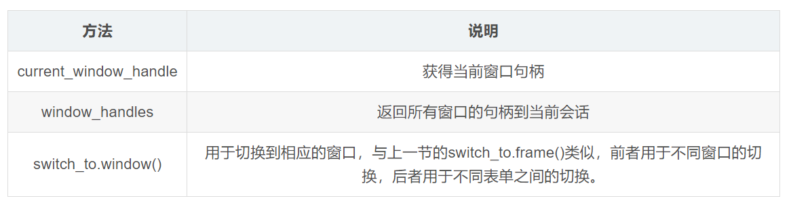

# Selenium使用教程
{: .no_toc }

## 目录
{: .no_toc .text-delta }

1. TOC
{:toc}

---
Python Selenium是一个用于测试网站的自动化测试工具，支持各种浏览器包括Chrome、Firefox、Safari等主流界面浏览器，同时也支持phantomJS无界面浏览器。本文总结了Selenium的元素定位方法以及如何模拟人工操作，并提供了一些示例。
{: .fs-6 .fw-300 }

原文链接，原作凯耐, 有兴趣可以关注其CSDN博客。

- https://blog.csdn.net/weixin_36279318/article/details/79475388
- https://blog.csdn.net/weixin_36279318/article/details/105042947

## 安装Selenium

```python
pip install Selenium
```

要使用Selenium，还需要下载安装浏览器驱动。

### 驱动下载

1. chromedriver 下载地址：https://code.google.com/p/chromedriver/downloads/list

2. Firefox的驱动geckodriver 下载地址：https://github.com/mozilla/geckodriver/releases/

### 配置环境变量
手动创建一个存放浏览器驱动的目录，如： F:\GeckoDriver , 将下载的浏览器驱动文件（例如：chromedriver、geckodriver）丢到该目录下，接着设置环境变量。

我的电脑–>属性–>系统设置–>高级–>环境变量–>系统变量–>Path，将“F:\GeckoDriver”目录添加到Path的值中。比如：Path字段;F:\GeckoDriver

## 测试是否安装成功

```python
from selenium import webdriver

from time import sleep
#1.创建Chrome或Firefox浏览器对象，这会在电脑上在打开一个浏览器窗口
browser = webdriver.Chrome(executable_path ="F:\GeckoDriver\geckodriver")
browser = webdriver.Firefox(executable_path ="F:\GeckoDriver\geckodriver")

#2.通过浏览器向服务器发送URL请求。如果能打开百度网站，说明安装成功。
browser.get("https://www.baidu.com/")
```


## 元素定位方法

### 定位单个元素

selenium提供8种元素定位方式，包括DOM元素id, name和tag等等。它还支持xpath和css选择器。返回结果是元素对象。

```python
find_element_by_id
find_element_by_name
find_element_by_tag_name
find_element_by_xpath
find_element_by_css_selector
find_element_by_link_text
find_element_by_partial_link_text
find_element_by_class_name
```

接下来将以下面这个html页面为例演示如何使用以上各种定位方法。

```html

<html>
  <head>
  <body link="#0000cc">
    <a id="result_logo" href="/" onmousedown="return c({'fm':'tab','tab':'logo'})">
    <form id="form" class="fm" name="f" action="/s">
      <span class="soutu-btn"></span>
        <input id="kw" class="s_ipt" name="wd" value="" maxlength="255" autocomplete="off">

```

- 通过id定位:

```python
dr.find_element_by_id("kw")
```

- 通过name定位:

```python
dr.find_element_by_name("wd")
```

- 通过class name定位:

```python
dr.find_element_by_class_name("s_ipt")
```

- 通过tag name定位:

```python
dr.find_element_by_tag_name("input")
```

- 通过xpath定位，xpath定位有N种写法，这里列几个常用写法:
```python
  dr.find_element_by_xpath("//*[@id='kw']")
  dr.find_element_by_xpath("//*[@name='wd']")
  dr.find_element_by_xpath("//input[@class='s_ipt']")
  dr.find_element_by_xpath("/html/body/form/span/input")
  dr.find_element_by_xpath("//span[@class='soutu-btn']/input")
  dr.find_element_by_xpath("//form[@id='form']/span/input")
  dr.find_element_by_xpath("//input[@id='kw' and @name='wd']")
```

- 通过css定位，css定位有N种写法，这里列几个常用写法:
```python
  dr.find_element_by_css_selector("#kw")
  dr.find_element_by_css_selector("[name=wd]")
  dr.find_element_by_css_selector(".s_ipt")
  dr.find_element_by_css_selector("html > body > form > span > input")
  dr.find_element_by_css_selector("span.soutu-btn> input#kw")
  dr.find_element_by_css_selector("form#form > span > input")
```

- 通过link text定位:
```python
dr.find_element_by_link_text("新闻")
dr.find_element_by_link_text("hao123")
```
- 通过partial link text定位(根据link文本模糊查询):
```
dr.find_element_by_partial_link_text("新")
dr.find_element_by_partial_link_text("hao")
dr.find_element_by_partial_link_text("123")
```

### 定位多个元素

selenium还提供了定位多个元素的方法，只需要将`find_element_by`替换成`find_elements_by`即可。返回结果是定位元素列表。

```python
find_elements_by_name
find_elements_by_xpath
find_elements_by_link_text
find_elements_by_partial_link_text
find_elements_by_tag_name
find_elements_by_class_name
find_elements_by_css_selector
```

示例代码：

```python
from selenium import webdriver
from time import sleep

driver =webdriver.Firefox(executable_path ="F:\GeckoDriver\geckodriver")
driver.get("https://www.baidu.com")

driver.find_element_by_id("kw").send_keys("selenium")
driver.find_element_by_id("su").click()
sleep(1)

#1.定位一组元素
elements = driver.find_elements_by_xpath('//div/h3/a')
print(type(elements))

#2.循环遍历出每一条搜索结果的标题
for t in elements:
    print(t.text)
    element=driver.find_element_by_link_text(t.text)
    element.click()
    sleep(3)

driver.quit()

```
### 定位动态加载元素

有时页面是动态加载的，我们希望在页面上特定元素出现后才开始解析页面，解析数据，这时可以用WebDriverWait提供的`wait.until`方法，如下所示：

```python
from selenium import webdriver
from selenium.webdriver.common.by import By
from selenium.webdriver.common.keys import Keys
from selenium.webdriver.support import expected_conditions as EC
from selenium.webdriver.support.wait import WebDriverWait

#声明浏览器对象
browser = webdriver.Chrome()
try:
    browser.get('https://www.baidu.com')
    input = browser.find_element_by_id('kw')#根据ID找到对应的标签，这里是输入框
    input.send_keys('Python')             #输入文字
    input.send_keys(Keys.ENTER)            #模拟回车
    wait = WebDriverWait(browser, 10)      #创建一个等待10秒的对象
     #等待直到某个标签加载出来
    wait.until(EC.presence_of_element_located((By.ID, 'content_left')))   
    print(browser.current_url)
    print(browser.get_cookies())
    print(browser.page_source)
finally:
    browser.close()
```

### 定位隐藏元素

有时页面上还有隐藏元素(比如表单上的陷阱)，可以使用`is_displayed`方法来进行判断。

```python
from selenium import webdriver
from selenium.webdriver.remote.webelement import WebElement

driver = webdriver.Chrome()
driver.get('https://www.xxx.com')

fields = driver.find_elements_by_tag_name("input")
for field in fields:
    if not field.is_displayed():
        print("Do not change value of "+field.get_attribute("name"))
```

##  获取文本值或属性

不管是在做功能测试还是自动化测试，经常需要获取定位元素的文本值或属性。Selenium提供了`page_source`, `title`, `current_url`,`text`和`get_attribute`方法来实现这个目的。


示例代码：

```python
from selenium import webdriver
from time import sleep

driver = webdriver.Firefox(executable_path ="F:\GeckoDriver\geckodriver")
driver.get("https://www.baidu.com")

print('Before search================')

# 打印当前页面源码
source = driver.page_source
print(source)

# 打印当前页面title
title = driver.title
print(title)


# 打印当前页面URL
now_url = driver.current_url
print(now_url)

driver.find_element_by_id("kw").send_keys("selenium")
driver.find_element_by_id("su").click()
sleep(1)

print('After search================')

# 再次打印当前页面title
title = driver.title
print(title)

# 打印当前页面URL
now_url = driver.current_url
print(now_url)

# 获取结果数目
user = driver.find_element_by_class_name('nums').text
keywords = driver.find_element_by_id("kw").get_attribute("value")

print(user)
print(keywords)

#关闭所有窗口
driver.quit()
```
## 操作元素方法

### 操控浏览器窗口


实例演示：

```python
from selenium import webdriver

from time import sleep
#1.创建Chrome浏览器对象，这会在电脑上在打开一个浏览器窗口
browser = webdriver.Firefox(executable_path ="F:\GeckoDriver\geckodriver")

#2.通过浏览器向服务器发送URL请求
browser.get("https://www.baidu.com/")

sleep(3)

#3.刷新浏览器
browser.refresh()

#4.设置浏览器的大小
browser.set_window_size(1400,800)

#5.设置链接内容
element=browser.find_element_by_link_text("新闻")
element.click()

element=browser.find_element_by_link_text("“下团组”时间")
element.click()
```

### 操控鼠标

 在现实的自动化测试中关于鼠标的操作不仅仅是click()单击操作，还有很多操控方法包含在ActionChains类中。


示例代码：

```python

from selenium import webdriver
#1.引入 ActionChains 类
from selenium.webdriver.common.action_chains import ActionChains

#1.创建Chrome浏览器对象，这会在电脑上在打开一个浏览器窗口
driver = webdriver.Firefox(executable_path ="F:\GeckoDriver\geckodriver")

driver.get("https://www.baidu.com")

#2.定位到要悬停的元素
element= driver.find_element_by_link_text("设置")

#3.对定位到的元素执行鼠标悬停操作
ActionChains(driver).move_to_element(element).perform()

#找到链接
elem1=driver.find_element_by_link_text("搜索设置")
elem1.click()

#通过元素选择器找到id=sh_2,并点击设置
elem2=driver.find_element_by_id("sh_1")
elem2.click()

#保存设置
elem3=driver.find_element_by_class_name("prefpanelgo")
elem3.click()

```

### 键盘事件

Selenium中的Key模块为我们提供了模拟键盘按键的方法，那就是send_keys()方法。它不仅可以模拟键盘输入，也可以模拟键盘的操作。


示例代码：

```python
# 输入框输入关键词
driver.find_element_by_id("kw").send_keys("关键词")
# 提交
driver.find_element_by_id("btnSubmit").send_keys(Keys.ENTER)
```

### 切换frame表单

在Web应用中经常会遇到frame/iframe表单嵌套页面的应用，WebDriver只能在一个页面上对元素识别与定位，对于frame/iframe表单内嵌页面上的元素无法直接定位。这时就需要通过`switch_to.frame()`方法将当前定位的主体切换为frame/iframe表单的内嵌页面中。

示例代码：

```python
# 模拟126邮箱登录
from selenium import webdriver

driver = webdriver.Chrome()
driver.get("http://www.126.com")

# 切换Frame方法1
driver.switch_to.frame('x-URS-iframe')
# 切换Frame方法2： 先通过xpath定位到iframe，再切换
# 再将定位对象传给switch_to.frame()方法
xf = driver.find_element_by_xpath('//*[@id="x-URS-iframe"]')

driver.find_element_by_name("email").clear()
driver.find_element_by_name("email").send_keys("username")
driver.find_element_by_name("password").clear()
driver.find_element_by_name("password").send_keys("password")
driver.find_element_by_id("dologin").click()

# 跳回最外层的页面
driver.switch_to.default_content()

driver.quit()
```

### 多窗口切换

在页面操作过程中有时候点击某个链接会弹出新的窗口，这时就需要主机切换到新打开的窗口上进行操作。WebDriver提供了`switch_to.window()`方法，可以实现在不同的窗口之间切换。



示例代码：

```python
from selenium import webdriver
import time
driver = webdriver.Chrome("F:\Chrome\ChromeDriver\chromedriver")
driver.implicitly_wait(10)
driver.get("http://www.baidu.com")

#1.获得百度搜索窗口句柄
current_windows = driver.current_window_handle

driver.find_element_by_link_text('登录').click()
driver.find_element_by_link_text("立即注册").click()

#1.获得当前所有打开的窗口的句柄
all_handles = driver.window_handles

#3.进入注册窗口
for handle in all_handles:
    if handle != current_windows:
        driver.switch_to.window(handle)
        print('跳转到注册窗口')
        driver.find_element_by_name("account").send_keys('123456789')
        driver.find_element_by_name('password').send_keys('123456789')
        time.sleep(2)
    
driver.quit()

```

### 警告框处理

在WebDriver中处理JavaScript所生成的alert、confirm以及prompt十分简单，具体做法是使用` switch_to.alert` 方法定位到 alert/confirm/prompt，然后使用`text/accept/dismiss/send_keys`等方法进行操作。


示例演示：

```python
from selenium import webdriver
from selenium.webdriver.common.action_chains import ActionChains
import time

driver = webdriver.Chrome()
driver.implicitly_wait(10)
driver.get('http://www.baidu.com')

# 鼠标悬停至“设置”链接
link = driver.find_element_by_link_text('设置')
ActionChains(driver).move_to_element(link).perform()

# 打开搜索设置
driver.find_element_by_link_text("搜索设置").click()

#在此处设置等待2s否则可能报错
time.sleep(2)
# 保存设置
driver.find_element_by_class_name("prefpanelgo").click()
time.sleep(2)

# 接受警告框
driver.switch_to.alert.accept()

driver.quit()
```

### 下拉框选择操作

导入选择下拉框Select类，使用该类处理下拉框操作。

```python
from selenium.webdriver.support.select import Select
```

Select类的方法


示例代码

```python
from selenium import webdriver
from selenium.webdriver.support.select import Select
from time import sleep

driver = webdriver.Chrome("F:\Chrome\ChromeDriver\chromedriver")
driver.implicitly_wait(10)
driver.get('http://www.baidu.com')

#1.鼠标悬停至“设置”链接
driver.find_element_by_link_text('设置').click()
sleep(1)
#2.打开搜索设置
driver.find_element_by_link_text("搜索设置").click()
sleep(2)

#3.搜索结果显示条数
sel = driver.find_element_by_xpath("//select[@id='nr']")
Select(sel).select_by_value('50')  # 显示50条

sleep(3)
driver.quit()
```

其它方法还包括:

```python
deselect_all() # 取消所有选项
deselect_by_index() # 取消对应 index 选项
deselect_by_value() # 取消对应 value 选项
deselect_by_visible_text() # 取消对应文本选项
first_selected_option() # 返回第一个选项
all_selected_options() # 返回所有的选项
```

### 文件上传

对于通过input标签实现的上传功能，可以将其看作是一个输入框，即通过send_keys()指定本地文件路径的方式实现文件上传。通过send_keys()方法来实现文件上传:

```python
from selenium import webdriver
import os

driver = webdriver.Firefox()
file_path = 'file:///' + os.path.abspath('upfile.html')
driver.get(file_path)

# 定位上传按钮，添加本地文件
driver.find_element_by_name("file").send_keys('D:\\upload_file.txt')

driver.quit()
```

### cookie操作

有时候我们需要验证浏览器中cookie是否正确，因为基于真实cookie的测试是无法通过白盒和集成测试进行的。WebDriver提供了操作Cookie的相关方法，可以读取、添加和删除cookie信息。

WebDriver操作cookie的方法:


示例代码:

```python

from selenium import webdriver
import time
browser = webdriver.Chrome("F:\Chrome\ChromeDriver\chromedriver")
browser.get("http://www.youdao.com")

#1.打印cookie信息
print('=====================================')
print("打印cookie信息为：")
print(browser.get_cookies)

#2.添加cookie信息
dict={'name':"name",'value':'Kaina'}
browser.add_cookie(dict)

print('=====================================')
print('添加cookie信息为：')
#3.遍历打印cookie信息
for cookie in browser.get_cookies():
    print('%s----%s\n' %(cookie['name'],cookie['value']))
    
#4.删除一个cookie
browser.delete_cookie('name')
print('=====================================')
print('删除一个cookie')
for cookie in browser.get_cookies():
    print('%s----%s\n' %(cookie['name'],cookie['value']))

print('=====================================')
print('删除所有cookie后：')
#5.删除所有cookie,无需传递参数
browser.delete_all_cookies()
for cookie in browser.get_cookies():
    print('%s----%s\n' %(cookie['name'],cookie['value']))

time.sleep(3)
browser.close()
```

### 调用JavaScript代码

虽然WebDriver提供了操作浏览器的前进和后退方法，但对于浏览器滚动条并没有提供相应的操作方法。在这种情况下，就可以借助JavaScript来控制浏览器的滚动条。WebDriver提供了execute_script()方法来执行JavaScript代码。

示例代码：

```python
from selenium import webdriver
from time import sleep

#1.访问百度
driver=webdriver.Firefox(executable_path ="F:\GeckoDriver\geckodriver")
driver.get("http://www.baidu.com")

#2.搜索
driver.find_element_by_id("kw").send_keys("selenium")
driver.find_element_by_id("su").click()

#3.休眠2s目的是获得服务器的响应内容，如果不使用休眠可能报错
sleep(2)

#4.通过javascript设置浏览器窗口的滚动条位置
js="window.scrollTo(100,450);"
driver.execute_script(js)
sleep(3)

driver.close()
```

### 窗口截图

自动化用例是由程序去执行的，因此有时候打印的错误信息并不十分明确。如果在脚本执行出错的时候能对当前窗口截图保存，那么通过图片就可以非常直观地看出出错的原因。WebDriver提供了截图函数`get_screenshot_as_file()`来截取当前窗口。

示例代码：

```python
from selenium import webdriver
from time import sleep

driver =webdriver.Firefox(executable_path ="F:\GeckoDriver\geckodriver")
driver.get('http://www.baidu.com')

driver.find_element_by_id('kw').send_keys('selenium')
driver.find_element_by_id('su').click()
sleep(2)

#1.截取当前窗口，并指定截图图片的保存位置
driver.get_screenshot_as_file("D:\\baidu_img.jpg")

driver.quit()
```

### 关闭浏览器

在前面的例子中我们一直使用quit()方法，其含义为退出相关的驱动程序和关闭所有窗口。除此之外，WebDriver还提供了close()方法，用来关闭当前窗口。


## 实战案例

### 模拟登录慕课网

慕课网的登录界面如下所示, 先登录后编辑个人资料。


示例代码：

```python
from time import sleep
from selenium import webdriver
from selenium.webdriver.support.select import Select
 
driver = webdriver.Firefox(executable_path="F:\GeckoDriver\geckodriver")
driver.get("https://www.imooc.com/")
driver.implicitly_wait(10)

# 1. 访问首页，点击登录，跳转到上面登录页面
driver.find_element_by_link_text("登录").click()
sleep(3)
 
# 2.输入用户和密码点击提交
driver.find_element_by_class_name("xa-emailOrPhone").send_keys(xxx)
driver.find_element_by_name("password").send_keys("xxx")
# Checkox方法包括isEnable(),isSelect(), is_displayed()和click()
element1 = driver.find_element_by_id("auto-signin")
    if not element1.isSelect()：
        element1.click()
driver.find_element_by_css_selector('input[value="登录"]').click()
sleep(6)

# 3.跳转到个人编辑页面
driver.get("https://www.imooc.com/user/setprofile")
sleep(3)
driver.find_element_by_link_text("编辑").click()
sleep(3)

# 4.下拉框操作
formElememt = driver.find_element_by_id("profile")
element1 = formElememt.find_element_by_id("job") # 选择工作下拉菜单
Select(element1).select_by_value("18")
 
element12 = formElememt.find_element_by_id("province-select")
Select(element12).select_by_visible_text("湖南")
 
# 5.radio的使用
element3 = driver.find_element_by_xpath("(//input[@type='radio'])[5]")
if not element3.is_selected():
    element3.click()
 
#6.文本框
driver.find_element_by_xpath("(//textarea[@name='aboutme'])[2]").send_keys("123123123")
```

## 小结

本文介绍了Selenium的安装，以及如何使用它定位元素，获取元素的文本值或属性，以及如何操作各种元素比如窗口、鼠标、键盘以及表单。

本文根据网络资料整理。我是大江狗，一名Python Web技术开发爱好者。您可以通过搜索【<a href="https://blog.csdn.net/weixin_42134789">CSDN大江狗</a>】、【<a href="https://www.zhihu.com/people/shi-yun-bo-53">知乎大江狗</a>】和搜索微信公众号【Python Web与Django开发】关注我！

